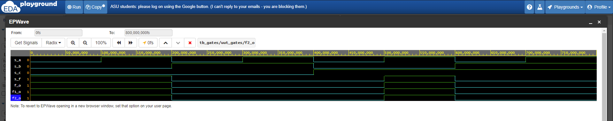
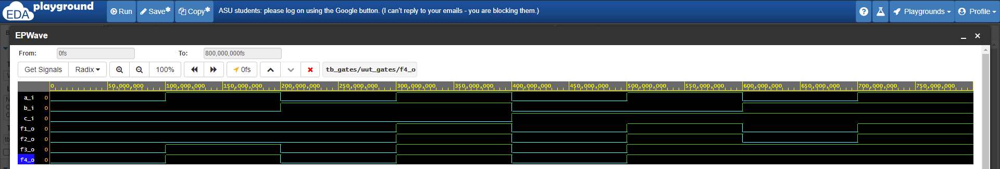

## Lab assignment

1. Submit the GitHub link to your `Digital-electronics-1` repository.

2. Verification of De Morgan's laws of function f(c,b,a). Submit:
    * Listing of VHDL code `design.vhd`,
    * Screenshot with simulated time waveforms,
    * Link to your public EDA Playground example.

3. Verification of Distributive laws. Submit:
    * Listing of VHDL code `design.vhd`,
    * Screenshot with simulated time waveforms,
    * Link to your public EDA Playground example.

------------------------------------------------------------------------

1

### Link to my github repository

[This is link to my repository](https://github.com/xfrolk03/Digital-electronics-1-2021)

2

### Listing of VHDL code `design.vhd` for De Morgan's laws 

```vhdl
------------------------------------------------------------------------
--
-- Example of basic OR, AND, XOR gates.
-- Nexys A7-50T, Vivado v2020.1, EDA Playground
--
-- Copyright (c) 2019-2020 Tomas Fryza
-- Dept. of Radio Electronics, Brno University of Technology, Czechia
-- This work is licensed under the terms of the MIT license.
--
------------------------------------------------------------------------

library ieee;               -- Standard library
use ieee.std_logic_1164.all;-- Package for data types and logic operations

------------------------------------------------------------------------
-- Entity declaration for basic gates
------------------------------------------------------------------------
entity gates is
    port(
        a_i    : in  std_logic;         -- Data input
        b_i    : in  std_logic;         -- Data input
        c_i    : in  std_logic;         -- Data input
        for_o  : out std_logic;         -- OR output function
        fand_o : out std_logic;         -- AND output function
        fxor_o : out std_logic;		-- XOR output function
        f_o    : out std_logic;
        f1_o   : out std_logic;
        f2_o   : out std_logic
    );
end entity gates;

------------------------------------------------------------------------
-- Architecture body for basic gates
------------------------------------------------------------------------
architecture dataflow of gates is
begin
--    for_o  <= a_i or b_i;
--    fand_o <= a_i and b_i;
--    fxor_o <= a_i xor b_i;
    
    f_o    <= (NOT(b_i) AND (a_i)) OR ((NOT(c_i) AND not(b_i)));
    f1_o   <= ((a_i) NAND NOT (b_i)) NAND (NOT (b_i) NAND NOT (c_i));
    f2_o   <= ((a_i) NOR NOT (c_i)) NOR (b_i);
    
end architecture dataflow;
```

### Table of logical values

| **c** | **b** |**a** | **f(c,b,a)** |
| :-: | :-: | :-: | :-: |
| 0 | 0 | 0 | 1 |
| 0 | 0 | 1 | 1 |
| 0 | 1 | 0 | 0 |
| 0 | 1 | 1 | 0 |
| 1 | 0 | 0 | 0 |
| 1 | 0 | 1 | 1 |
| 1 | 1 | 0 | 0 |
| 1 | 1 | 1 | 0 |

### Simulation photo



[This is link to my EDA plaground example of De Morgan's laws](https://www.edaplayground.com/x/eDBZ)


3

### Listing of VHDL code `design.vhd` for Distributive laws

```vhdl
------------------------------------------------------------------------
--
-- Example of basic OR, AND, XOR gates.
-- Nexys A7-50T, Vivado v2020.1, EDA Playground
--
-- Copyright (c) 2019-2020 Tomas Fryza
-- Dept. of Radio Electronics, Brno University of Technology, Czechia
-- This work is licensed under the terms of the MIT license.
--
------------------------------------------------------------------------

library ieee;               -- Standard library
use ieee.std_logic_1164.all;-- Package for data types and logic operations

------------------------------------------------------------------------
-- Entity declaration for basic gates
------------------------------------------------------------------------
entity gates is
    port(
        a_i    : in  std_logic;         -- Data input
        b_i    : in  std_logic;         -- Data input
        c_i    : in  std_logic;         -- Data input
        for_o  : out std_logic;         -- OR output function
        fand_o : out std_logic;         -- AND output function
        fxor_o : out std_logic;			-- XOR output function
        f_o    : out std_logic;
        f1_o   : out std_logic;
        f2_o   : out std_logic;
        f3_o   : out std_logic;
        f4_o   : out std_logic
    );
end entity gates;

------------------------------------------------------------------------
-- Architecture body for basic gates
------------------------------------------------------------------------
architecture dataflow of gates is
begin
--    for_o  <= a_i or b_i;
--    fand_o <= a_i and b_i;
--    fxor_o <= a_i xor b_i;
    
    f1_o   <= (a_i AND b_i) OR (a_i AND c_i);
    f2_o   <= (a_i) AND (b_i OR c_i);
    f3_o   <= (a_i OR b_i) AND (a_i OR c_i);
    f4_o   <=  a_i OR (b_i AND c_i);
    
end architecture dataflow;
```

### Simulation photo



[This is link to my EDA plaground example of Distributive laws](https://www.edaplayground.com/x/CtyQ)
