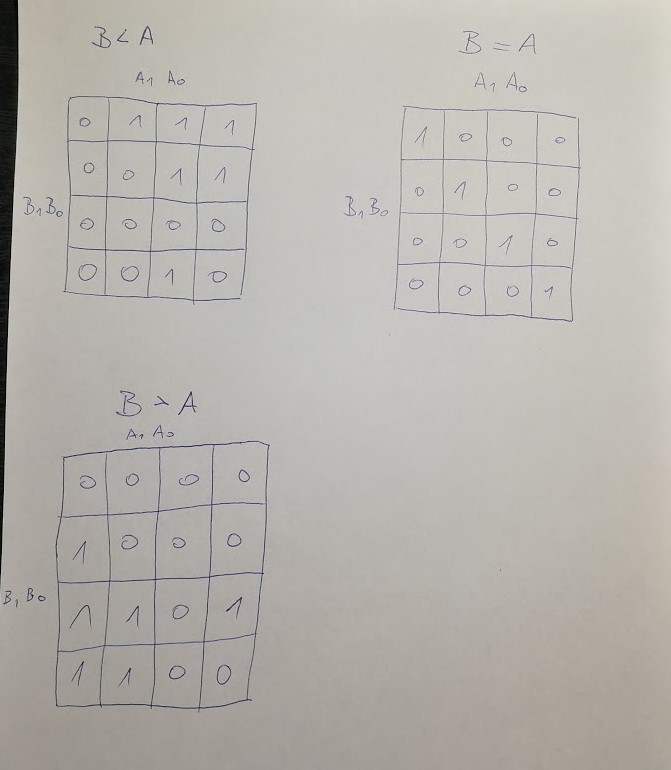
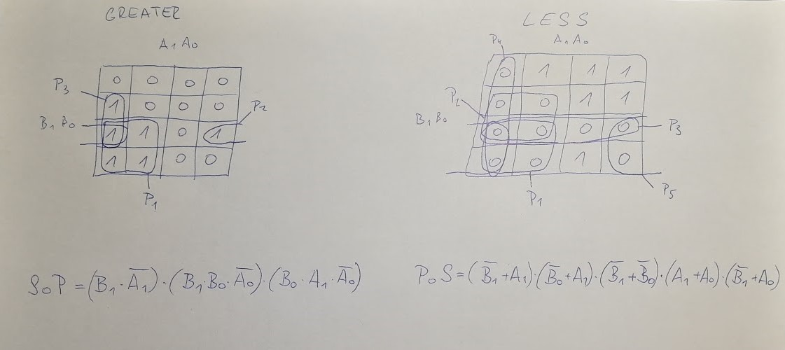

## Lab assignment

1. Preparation tasks (done before the lab at home). Submit:
    * Completed 2-bit comparator truth table.

2. A 2-bit comparator. Submit:
    * Karnaugh maps for all three functions,
    * Equations of simplified SoP form of the "greater than" function and simplified PoS form of the "less than" function.
    * Link to your public EDA Playground example in the form `https://www.edaplayground.com/...`

3. A 4-bit binary comparator. Submit:
    * Listing of VHDL architecture from design file (`design.vhd`) with syntax highlighting,
    * Listing of VHDL stimulus process from testbench file (`testbench.vhd`) with syntax highlighting,
    * Listing of simulator console output, i.e. with one reported error,
    * Link to your public EDA Playground example in the form `https://www.edaplayground.com/...`

------------------------------------------------------------------------

## 1.Preparation tasks
### Completed 2-bit comparator truth table.

| **Dec. equivalent** |**B1**|**B0**|**A1**|**A0**|**B > A**|**B = A**|**B < A**|
|        :-:          | :-:  | :-:  |  :-: |  :-: |   :-:   |   :-:   |   :-:   |
|         0           | 0    |  0   |   0  |   0  |    0    |    1    |    0    |
|         1           | 0    |  0   |   0  |   1  |    0    |    0    |    1    |
|         2           | 0    |  0   |   1  |   0  |    0    |    0    |    1    |
|         3           | 0    |  0   |   1  |   1  |    0    |    0    |    1    |
|         4           | 0    |  1   |   0  |   0  |    1    |    0    |    0    |
|         5           | 0    |  1   |   0  |   1  |    0    |    1    |    0    |
|         6           | 0    |  1   |   1  |   0  |    0    |    0    |    1    |
|         7           | 0    |  1   |   1  |   1  |    0    |    0    |    1    |
|         8           | 1    |  0   |   0  |   0  |    1    |    0    |    0    |
|         9           | 1    |  0   |   0  |   1  |    1    |    0    |    0    |
|         10          | 1    |  0   |   1  |   0  |    0    |    1    |    0    |
|         11          | 1    |  0   |   1  |   1  |    0    |    0    |    1    |
|         12          | 1    |  1   |   0  |   0  |    1    |    0    |    0    |
|         13          | 1    |  1   |   0  |   1  |    1    |    0    |    0    |
|         14          | 1    |  1   |   1  |   0  |    1    |    0    |    0    |
|         15          | 1    |  1   |   1  |   1  |    0    |    1    |    0    |

------------------------------------------------------------------------

## 2. A 2-bit comparator.
### Karnaugh maps for all three functions



### Equations of simplified SoP form of the "greater than" function and simplified PoS form of the "less than" function.



### [This is link to my EDA plaground example of 2 bit comparator](https://www.edaplayground.com/x/LXDB)

## 3. A 4-bit binary comparator.

### Listing of VHDL architecture from design file (`design.vhd`) with syntax highlighting

```vhdl
------------------------------------------------------------------------
--
-- Example of 4-bit binary comparator using the when/else assignment.
-- EDA Playground
--
-- Copyright (c) 2020-2021 Tomas Fryza
-- Dept. of Radio Electronics, Brno University of Technology, Czechia
-- This work is licensed under the terms of the MIT license.
--
------------------------------------------------------------------------

library ieee;
use ieee.std_logic_1164.all;

------------------------------------------------------------------------
-- Entity declaration for 4-bit binary comparator
------------------------------------------------------------------------
entity comparator_4bit is
    port(
        a_i           : in  std_logic_vector(4 - 1 downto 0);
        b_i           : in  std_logic_vector(4 - 1 downto 0);
        
        B_greater_A_o :	out std_logic;    -- B is greater than A
        B_equals_A_o  : out std_logic;    -- B equals A
        B_less_A_o    : out std_logic     -- B is less than A
        
    );
end entity comparator_4bit;

------------------------------------------------------------------------
-- Architecture body for 4-bit binary comparator
------------------------------------------------------------------------
architecture Behavioral of comparator_4bit is
begin

    B_greater_A_o <= '1' when (b_i > a_i) else '0';
    B_equals_A_o  <= '1' when (b_i = a_i) else '0';
    B_less_A_o    <= '1' when (b_i < a_i) else '0';

end architecture Behavioral;
```


### Listing of VHDL stimulus process from testbench file (`testbench.vhd`) with syntax highlighting
```vhdl
    --------------------------------------------------------------------
    -- Data generation process
    --------------------------------------------------------------------
    p_stimulus : process
    begin
        -- Report a note at the begining of stimulus process
        report "Stimulus process started" severity note;
 
 		s_b <= "0000"; s_a <= "0000"; wait for 100 ns;
		assert ((s_B_greater_A = '0') and (s_B_equals_A = '1') and (s_B_less_A = '0'))
		report "Test failed for input combination: 0000, 0000" severity error;
        
        	s_b <= "0000"; s_a <= "0001"; wait for 100 ns;
		assert ((s_B_greater_A = '0') and (s_B_equals_A = '0') and (s_B_less_A = '1'))
		report "Test failed for input combination: 0000, 0001" severity error;

		s_b <= "0000"; s_a <= "0010"; wait for 100 ns;
		assert ((s_B_greater_A = '0') and (s_B_equals_A = '0') and (s_B_less_A = '1'))
		report "Test failed for input combination: 0000, 0010" severity error;

		s_b <= "0000"; s_a <= "0011"; wait for 100 ns;
		assert ((s_B_greater_A = '0') and (s_B_equals_A = '0') and (s_B_less_A = '1'))
		report "Test failed for input combination: 0000, 0011" severity error;

		s_b <= "0000"; s_a <= "0100"; wait for 100 ns;
		assert ((s_B_greater_A = '0') and (s_B_equals_A = '0') and (s_B_less_A = '1'))
		report "Test failed for input combination: 0000, 0100" severity error;

		s_b <= "0000"; s_a <= "0101"; wait for 100 ns;
		assert ((s_B_greater_A = '0') and (s_B_equals_A = '0') and (s_B_less_A = '1'))
		report "Test failed for input combination: 0000, 0101" severity error;

		s_b <= "0000"; s_a <= "0110"; wait for 100 ns;
		assert ((s_B_greater_A = '0') and (s_B_equals_A = '0') and (s_B_less_A = '1'))
		report "Test failed for input combination: 0000, 0110" severity error;

		s_b <= "0000"; s_a <= "0111"; wait for 100 ns;
		assert ((s_B_greater_A = '0') and (s_B_equals_A = '0') and (s_B_less_A = '1'))
		report "Test failed for input combination: 0000, 0111" severity error;

		s_b <= "0000"; s_a <= "1000"; wait for 100 ns;
		assert ((s_B_greater_A = '0') and (s_B_equals_A = '0') and (s_B_less_A = '1'))
		report "Test failed for input combination: 0000, 1000" severity error;

		s_b <= "0000"; s_a <= "1001"; wait for 100 ns;
		assert ((s_B_greater_A = '0') and (s_B_equals_A = '0') and (s_B_less_A = '1'))
		report "Test failed for input combination: 0000, 1001" severity error;

		s_b <= "0000"; s_a <= "1010"; wait for 100 ns;
		assert ((s_B_greater_A = '0') and (s_B_equals_A = '0') and (s_B_less_A = '1'))
		report "Test failed for input combination: 0000, 1010" severity error;

		s_b <= "0000"; s_a <= "1011"; wait for 100 ns;
		assert ((s_B_greater_A = '0') and (s_B_equals_A = '0') and (s_B_less_A = '1'))
		report "Test failed for input combination: 0000, 1011" severity error;

		s_b <= "0000"; s_a <= "1100"; wait for 100 ns;
		assert ((s_B_greater_A = '0') and (s_B_equals_A = '0') and (s_B_less_A = '1'))
		report "Test failed for input combination: 0000, 1100" severity error;

		s_b <= "0000"; s_a <= "1101"; wait for 100 ns;
		assert ((s_B_greater_A = '0') and (s_B_equals_A = '0') and (s_B_less_A = '1'))
		report "Test failed for input combination: 0000, 1101" severity error;

		s_b <= "0000"; s_a <= "1110"; wait for 100 ns;
		assert ((s_B_greater_A = '0') and (s_B_equals_A = '0') and (s_B_less_A = '1'))
		report "Test failed for input combination: 0000, 1110" severity error;

		s_b <= "0000"; s_a <= "1111"; wait for 100 ns;
		assert ((s_B_greater_A = '0') and (s_B_equals_A = '0') and (s_B_less_A = '1'))
		report "Test failed for input combination: 0000, 1111" severity error;

		s_b <= "0001"; s_a <= "0000"; wait for 100 ns;
		assert ((s_B_greater_A = '1') and (s_B_equals_A = '0') and (s_B_less_A = '0'))
		report "Test failed for input combination: 0001, 0000" severity error;

		s_b <= "0001"; s_a <= "0001"; wait for 100 ns;
		assert ((s_B_greater_A = '0') and (s_B_equals_A = '1') and (s_B_less_A = '0'))
		report "Test failed for input combination: 0001, 0001" severity error;

		s_b <= "0001"; s_a <= "0010"; wait for 100 ns;
		assert ((s_B_greater_A = '0') and (s_B_equals_A = '0') and (s_B_less_A = '1'))
		report "Test failed for input combination: 0001, 0010" severity error;

		s_b <= "0001"; s_a <= "0011"; wait for 100 ns;
		assert ((s_B_greater_A = '0') and (s_B_equals_A = '0') and (s_B_less_A = '1'))
		report "Test failed for input combination: 0001, 0011" severity error;

		s_b <= "0001"; s_a <= "0100"; wait for 100 ns;
		assert ((s_B_greater_A = '0') and (s_B_equals_A = '0') and (s_B_less_A = '1'))
		report "Test failed for input combination: 0001, 0100" severity error;

		s_b <= "0001"; s_a <= "0101"; wait for 100 ns;
		assert ((s_B_greater_A = '0') and (s_B_equals_A = '0') and (s_B_less_A = '1'))
		report "Test failed for input combination: 0001, 0101" severity error;

		s_b <= "0001"; s_a <= "0110"; wait for 100 ns;
		assert ((s_B_greater_A = '0') and (s_B_equals_A = '0') and (s_B_less_A = '1'))
		report "Test failed for input combination: 0001, 0110" severity error;

		s_b <= "0001"; s_a <= "0111"; wait for 100 ns;
		assert ((s_B_greater_A = '0') and (s_B_equals_A = '0') and (s_B_less_A = '1'))
		report "Test failed for input combination: 0001, 0111" severity error;

		s_b <= "0001"; s_a <= "1000"; wait for 100 ns;
		assert ((s_B_greater_A = '0') and (s_B_equals_A = '0') and (s_B_less_A = '1'))
		report "Test failed for input combination: 0001, 1000" severity error;

		s_b <= "0001"; s_a <= "1001"; wait for 100 ns;
		assert ((s_B_greater_A = '0') and (s_B_equals_A = '0') and (s_B_less_A = '1'))
		report "Test failed for input combination: 0001, 1001" severity error;

		s_b <= "0001"; s_a <= "1010"; wait for 100 ns;
		assert ((s_B_greater_A = '0') and (s_B_equals_A = '0') and (s_B_less_A = '1'))
		report "Test failed for input combination: 0001, 1010" severity error;

		s_b <= "0001"; s_a <= "1011"; wait for 100 ns;
		assert ((s_B_greater_A = '0') and (s_B_equals_A = '0') and (s_B_less_A = '1'))
		report "Test failed for input combination: 0001, 1011" severity error;

		s_b <= "0001"; s_a <= "1100"; wait for 100 ns;
		assert ((s_B_greater_A = '0') and (s_B_equals_A = '0') and (s_B_less_A = '1'))
		report "Test failed for input combination: 0001, 1101" severity error;

		s_b <= "0001"; s_a <= "1101"; wait for 100 ns;
		assert ((s_B_greater_A = '0') and (s_B_equals_A = '0') and (s_B_less_A = '1'))
		report "Test failed for input combination: 0001, 1101" severity error;

		s_b <= "0001"; s_a <= "1110"; wait for 100 ns;
		assert ((s_B_greater_A = '0') and (s_B_equals_A = '0') and (s_B_less_A = '1'))
		report "Test failed for input combination: 0001, 1110" severity error;

		s_b <= "0001"; s_a <= "1111"; wait for 100 ns;
		assert ((s_B_greater_A = '0') and (s_B_equals_A = '0') and (s_B_less_A = '1'))
		report "Test failed for input combination: 0001, 1111" severity error;

		s_b <= "0010"; s_a <= "1101"; wait for 100 ns;
		assert ((s_B_greater_A = '0') and (s_B_equals_A = '0') and (s_B_less_A = '1'))
		report "Test failed for input combination: 0010, 1101" severity error;

		s_b <= "0010"; s_a <= "1110"; wait for 100 ns;
		assert ((s_B_greater_A = '0') and (s_B_equals_A = '0') and (s_B_less_A = '1'))
		report "Test failed for input combination: 0010, 1110" severity error;

		s_b <= "0010"; s_a <= "1111"; wait for 100 ns;
		assert ((s_B_greater_A = '0') and (s_B_equals_A = '0') and (s_B_less_A = '1'))
		report "Test failed for input combination: 0010, 1111" severity error;

		s_b <= "0011"; s_a <= "0000"; wait for 100 ns;
		assert ((s_B_greater_A = '1') and (s_B_equals_A = '0') and (s_B_less_A = '0'))
		report "Test failed for input combination: 0011, 0000" severity error;

		s_b <= "0011"; s_a <= "0001"; wait for 100 ns;
		assert ((s_B_greater_A = '1') and (s_B_equals_A = '0') and (s_B_less_A = '0'))
		report "Test failed for input combination: 0011, 0001" severity error;

		s_b <= "0011"; s_a <= "0010"; wait for 100 ns;
		assert ((s_B_greater_A = '1') and (s_B_equals_A = '0') and (s_B_less_A = '0'))
		report "Test failed for input combination: 0011, 0010" severity error;

		s_b <= "0011"; s_a <= "0011"; wait for 100 ns;
		assert ((s_B_greater_A = '0') and (s_B_equals_A = '1') and (s_B_less_A = '0'))
		report "Test failed for input combination: 0011, 0011" severity error;

		s_b <= "0011"; s_a <= "0100"; wait for 100 ns;
		assert ((s_B_greater_A = '0') and (s_B_equals_A = '0') and (s_B_less_A = '1'))
		report "Test failed for input combination: 0011, 0100" severity error;

		s_b <= "0011"; s_a <= "0101"; wait for 100 ns;
		assert ((s_B_greater_A = '0') and (s_B_equals_A = '0') and (s_B_less_A = '1'))
		report "Test failed for input combination: 0011, 0101" severity error;

		s_b <= "0011"; s_a <= "0110"; wait for 100 ns;
		assert ((s_B_greater_A = '0') and (s_B_equals_A = '0') and (s_B_less_A = '1'))
		report "Test failed for input combination: 0011, 0110" severity error;

		s_b <= "0011"; s_a <= "0111"; wait for 100 ns;
		assert ((s_B_greater_A = '0') and (s_B_equals_A = '0') and (s_B_less_A = '1'))
		report "Test failed for input combination: 0011, 0111" severity error;

		s_b <= "0011"; s_a <= "1000"; wait for 100 ns;
		assert ((s_B_greater_A = '0') and (s_B_equals_A = '0') and (s_B_less_A = '1'))
		report "Test failed for input combination: 0011, 1000" severity error;

		s_b <= "0011"; s_a <= "1001"; wait for 100 ns;
		assert ((s_B_greater_A = '0') and (s_B_equals_A = '0') and (s_B_less_A = '1'))
		report "Test failed for input combination: 0011, 1001" severity error;

		s_b <= "0011"; s_a <= "1010"; wait for 100 ns;
		assert ((s_B_greater_A = '0') and (s_B_equals_A = '0') and (s_B_less_A = '1'))
		report "Test failed for input combination: 0011, 1010" severity error;

		s_b <= "0011"; s_a <= "1011"; wait for 100 ns;
		assert ((s_B_greater_A = '0') and (s_B_equals_A = '0') and (s_B_less_A = '1'))
		report "Test failed for input combination: 0011, 1011" severity error;

		s_b <= "0011"; s_a <= "1100"; wait for 100 ns;
		assert ((s_B_greater_A = '0') and (s_B_equals_A = '0') and (s_B_less_A = '1'))
		report "Test failed for input combination: 0011, 1100" severity error;

		s_b <= "0011"; s_a <= "1101"; wait for 100 ns;
		assert ((s_B_greater_A = '0') and (s_B_equals_A = '0') and (s_B_less_A = '1'))
		report "Test failed for input combination: 0011, 1101" severity error;

		s_b <= "0011"; s_a <= "1110"; wait for 100 ns;
		assert ((s_B_greater_A = '0') and (s_B_equals_A = '0') and (s_B_less_A = '1'))
		report "Test failed for input combination: 0011, 1110" severity error;

		s_b <= "0011"; s_a <= "1111"; wait for 100 ns;
		assert ((s_B_greater_A = '0') and (s_B_equals_A = '0') and (s_B_less_A = '1'))
		report "Test failed for input combination: 0011, 1111" severity error;

		s_b <= "0100"; s_a <= "0000"; wait for 100 ns;
		assert ((s_B_greater_A = '1') and (s_B_equals_A = '0') and (s_B_less_A = '0'))
		report "Test failed for input combination: 0100, 0000" severity error;

		s_b <= "0100"; s_a <= "0001"; wait for 100 ns;
		assert ((s_B_greater_A = '1') and (s_B_equals_A = '0') and (s_B_less_A = '0'))
		report "Test failed for input combination: 0100, 0001" severity error;

		s_b <= "0100"; s_a <= "0010"; wait for 100 ns;
		assert ((s_B_greater_A = '1') and (s_B_equals_A = '0') and (s_B_less_A = '0'))
		report "Test failed for input combination: 0100, 0010" severity error;

		s_b <= "0100"; s_a <= "0011"; wait for 100 ns;
		assert ((s_B_greater_A = '1') and (s_B_equals_A = '0') and (s_B_less_A = '0'))
		report "Test failed for input combination: 0100, 0011" severity error;

		s_b <= "0101"; s_a <= "0000"; wait for 100 ns;
		assert ((s_B_greater_A = '1') and (s_B_equals_A = '0') and (s_B_less_A = '0'))
		report "Test failed for input combination: 0101, 0000" severity error;

		s_b <= "0101"; s_a <= "0001"; wait for 100 ns;
		assert ((s_B_greater_A = '1') and (s_B_equals_A = '0') and (s_B_less_A = '0'))
		report "Test failed for input combination: 0101, 0001" severity error;

		s_b <= "0101"; s_a <= "0010"; wait for 100 ns;
		assert ((s_B_greater_A = '1') and (s_B_equals_A = '0') and (s_B_less_A = '0'))
		report "Test failed for input combination: 0101, 0010" severity error;

		s_b <= "0101"; s_a <= "0011"; wait for 100 ns;
		assert ((s_B_greater_A = '1') and (s_B_equals_A = '0') and (s_B_less_A = '0'))
		report "Test failed for input combination: 0101, 0011" severity error;

		s_b <= "0101"; s_a <= "0100"; wait for 100 ns;
		assert ((s_B_greater_A = '1') and (s_B_equals_A = '0') and (s_B_less_A = '0'))
		report "Test failed for input combination: 0101, 0100" severity error;

		s_b <= "0101"; s_a <= "0101"; wait for 100 ns;
		assert ((s_B_greater_A = '0') and (s_B_equals_A = '1') and (s_B_less_A = '0'))
		report "Test failed for input combination: 0101, 0101" severity error;

		s_b <= "0101"; s_a <= "0110"; wait for 100 ns;
		assert ((s_B_greater_A = '0') and (s_B_equals_A = '0') and (s_B_less_A = '1'))
		report "Test failed for input combination: 0101, 0110" severity error;

		s_b <= "0101"; s_a <= "0111"; wait for 100 ns;
		assert ((s_B_greater_A = '0') and (s_B_equals_A = '0') and (s_B_less_A = '1'))
		report "Test failed for input combination: 0101, 0111" severity error;


		s_b <= "0110"; s_a <= "0110"; wait for 100 ns;
		assert ((s_B_greater_A = '0') and (s_B_equals_A = '1') and (s_B_less_A = '0'))
		report "Test failed for input combination: 0110, 0110" severity error;

		s_b <= "0110"; s_a <= "0111"; wait for 100 ns;
		assert ((s_B_greater_A = '0') and (s_B_equals_A = '0') and (s_B_less_A = '1'))
		report "Test failed for input combination: 0110, 0111" severity error;

		s_b <= "0110"; s_a <= "1000"; wait for 100 ns;
		assert ((s_B_greater_A = '0') and (s_B_equals_A = '0') and (s_B_less_A = '1'))
		report "Test failed for input combination: 0110, 1000" severity error;

		s_b <= "0110"; s_a <= "1001"; wait for 100 ns;
		assert ((s_B_greater_A = '0') and (s_B_equals_A = '0') and (s_B_less_A = '1'))
		report "Test failed for input combination: 0110, 1001" severity error;

		s_b <= "0110"; s_a <= "1010"; wait for 100 ns;
		assert ((s_B_greater_A = '0') and (s_B_equals_A = '0') and (s_B_less_A = '1'))
		report "Test failed for input combination: 0110, 1010" severity error;

		s_b <= "0110"; s_a <= "1011"; wait for 100 ns;
		assert ((s_B_greater_A = '0') and (s_B_equals_A = '0') and (s_B_less_A = '1'))
		report "Test failed for input combination: 0110, 1011" severity error;

		s_b <= "0110"; s_a <= "1100"; wait for 100 ns;
		assert ((s_B_greater_A = '0') and (s_B_equals_A = '0') and (s_B_less_A = '1'))
		report "Test failed for input combination: 0110, 1100" severity error;

		s_b <= "0110"; s_a <= "1101"; wait for 100 ns;
		assert ((s_B_greater_A = '0') and (s_B_equals_A = '0') and (s_B_less_A = '1'))
		report "Test failed for input combination: 0110, 1101" severity error;

		s_b <= "0110"; s_a <= "1110"; wait for 100 ns;
		assert ((s_B_greater_A = '0') and (s_B_equals_A = '0') and (s_B_less_A = '1'))
		report "Test failed for input combination: 0110, 1110" severity error;

		s_b <= "0110"; s_a <= "1111"; wait for 100 ns;
		assert ((s_B_greater_A = '0') and (s_B_equals_A = '0') and (s_B_less_A = '1'))
		report "Test failed for input combination: 0110, 1111" severity error;

		s_b <= "0111"; s_a <= "0000"; wait for 100 ns;
		assert ((s_B_greater_A = '1') and (s_B_equals_A = '0') and (s_B_less_A = '0'))
		report "Test failed for input combination: 0111, 0000" severity error;

		s_b <= "0111"; s_a <= "0001"; wait for 100 ns;
		assert ((s_B_greater_A = '1') and (s_B_equals_A = '0') and (s_B_less_A = '0'))
		report "Test failed for input combination: 0111, 0001" severity error;

		s_b <= "0111"; s_a <= "0010"; wait for 100 ns;
		assert ((s_B_greater_A = '1') and (s_B_equals_A = '0') and (s_B_less_A = '0'))
		report "Test failed for input combination: 0111, 0010" severity error;

		s_b <= "0111"; s_a <= "0011"; wait for 100 ns;
		assert ((s_B_greater_A = '1') and (s_B_equals_A = '0') and (s_B_less_A = '0'))
		report "Test failed for input combination: 0111, 0011" severity error;

		s_b <= "0111"; s_a <= "0100"; wait for 100 ns;
		assert ((s_B_greater_A = '1') and (s_B_equals_A = '0') and (s_B_less_A = '0'))
		report "Test failed for input combination: 0111, 0100" severity error;

		s_b <= "0111"; s_a <= "0101"; wait for 100 ns;
		assert ((s_B_greater_A = '1') and (s_B_equals_A = '0') and (s_B_less_A = '0'))
		report "Test failed for input combination: 0111, 0101" severity error;

		s_b <= "0111"; s_a <= "0110"; wait for 100 ns;
		assert ((s_B_greater_A = '1') and (s_B_equals_A = '0') and (s_B_less_A = '0'))
		report "Test failed for input combination: 0111, 0110" severity error;

		s_b <= "0111"; s_a <= "0111"; wait for 100 ns;
		assert ((s_B_greater_A = '0') and (s_B_equals_A = '1') and (s_B_less_A = '0'))
		report "Test failed for input combination: 0111, 0111" severity error;

		s_b <= "0111"; s_a <= "1000"; wait for 100 ns;
		assert ((s_B_greater_A = '0') and (s_B_equals_A = '0') and (s_B_less_A = '1'))
		report "Test failed for input combination: 0111, 1000" severity error;

		s_b <= "0111"; s_a <= "1001"; wait for 100 ns;
		assert ((s_B_greater_A = '0') and (s_B_equals_A = '0') and (s_B_less_A = '1'))
		report "Test failed for input combination: 0111, 1001" severity error;

		s_b <= "0111"; s_a <= "1010"; wait for 100 ns;
		assert ((s_B_greater_A = '0') and (s_B_equals_A = '0') and (s_B_less_A = '1'))
		report "Test failed for input combination: 0111, 1010" severity error;

		s_b <= "0111"; s_a <= "1011"; wait for 100 ns;
		assert ((s_B_greater_A = '0') and (s_B_equals_A = '0') and (s_B_less_A = '1'))
		report "Test failed for input combination: 0111, 1011" severity error;

		s_b <= "0111"; s_a <= "1100"; wait for 100 ns;
		assert ((s_B_greater_A = '0') and (s_B_equals_A = '0') and (s_B_less_A = '1'))
		report "Test failed for input combination: 0111, 1100" severity error;

		s_b <= "0111"; s_a <= "1101"; wait for 100 ns;
		assert ((s_B_greater_A = '0') and (s_B_equals_A = '0') and (s_B_less_A = '1'))
		report "Test failed for input combination: 0111, 1101" severity error;

		s_b <= "0111"; s_a <= "1110"; wait for 100 ns;
		assert ((s_B_greater_A = '0') and (s_B_equals_A = '0') and (s_B_less_A = '1'))
		report "Test failed for input combination: 0111, 1110" severity error;

		s_b <= "0111"; s_a <= "1111"; wait for 100 ns;
		assert ((s_B_greater_A = '0') and (s_B_equals_A = '0') and (s_B_less_A = '1'))
		report "Test failed for input combination: 0111, 1111" severity error;

		s_b <= "1000"; s_a <= "0000"; wait for 100 ns;
		assert ((s_B_greater_A = '1') and (s_B_equals_A = '0') and (s_B_less_A = '0'))
		report "Test failed for input combination: 1000, 0000" severity error;

		s_b <= "1000"; s_a <= "0001"; wait for 100 ns;
		assert ((s_B_greater_A = '1') and (s_B_equals_A = '0') and (s_B_less_A = '0'))
		report "Test failed for input combination: 1000, 0001" severity error;

		s_b <= "1000"; s_a <= "0010"; wait for 100 ns;
		assert ((s_B_greater_A = '1') and (s_B_equals_A = '0') and (s_B_less_A = '0'))
		report "Test failed for input combination: 1000, 0010" severity error;

		s_b <= "1000"; s_a <= "0011"; wait for 100 ns;
		assert ((s_B_greater_A = '1') and (s_B_equals_A = '0') and (s_B_less_A = '0'))
		report "Test failed for input combination: 1000, 0011" severity error;

		s_b <= "1000"; s_a <= "0100"; wait for 100 ns;
		assert ((s_B_greater_A = '1') and (s_B_equals_A = '0') and (s_B_less_A = '0'))
		report "Test failed for input combination: 1000, 0100" severity error;

		s_b <= "1000"; s_a <= "0101"; wait for 100 ns;
		assert ((s_B_greater_A = '1') and (s_B_equals_A = '0') and (s_B_less_A = '0'))
		report "Test failed for input combination: 1000, 0101" severity error;

		s_b <= "1000"; s_a <= "0110"; wait for 100 ns;
		assert ((s_B_greater_A = '1') and (s_B_equals_A = '0') and (s_B_less_A = '0'))
		report "Test failed for input combination: 1000, 0110" severity error;

		s_b <= "1000"; s_a <= "0111"; wait for 100 ns;
		assert ((s_B_greater_A = '1') and (s_B_equals_A = '0') and (s_B_less_A = '0'))
		report "Test failed for input combination: 1000, 0111" severity error;

		s_b <= "1000"; s_a <= "1000"; wait for 100 ns;
		assert ((s_B_greater_A = '0') and (s_B_equals_A = '1') and (s_B_less_A = '0'))
		report "Test failed for input combination: 1000, 1000" severity error;

		s_b <= "1000"; s_a <= "1001"; wait for 100 ns;
		assert ((s_B_greater_A = '0') and (s_B_equals_A = '0') and (s_B_less_A = '1'))
		report "Test failed for input combination: 1000, 1001" severity error;

		s_b <= "1000"; s_a <= "1010"; wait for 100 ns;
		assert ((s_B_greater_A = '0') and (s_B_equals_A = '0') and (s_B_less_A = '1'))
		report "Test failed for input combination: 1000, 1010" severity error;

		s_b <= "1000"; s_a <= "1011"; wait for 100 ns;
		assert ((s_B_greater_A = '0') and (s_B_equals_A = '0') and (s_B_less_A = '1'))
		report "Test failed for input combination: 1000, 1011" severity error;

		s_b <= "1000"; s_a <= "1100"; wait for 100 ns;
		assert ((s_B_greater_A = '0') and (s_B_equals_A = '0') and (s_B_less_A = '1'))
		report "Test failed for input combination: 1000, 1100" severity error;

		s_b <= "1000"; s_a <= "1101"; wait for 100 ns;
		assert ((s_B_greater_A = '0') and (s_B_equals_A = '0') and (s_B_less_A = '1'))
		report "Test failed for input combination: 1000, 1101" severity error;

		s_b <= "1000"; s_a <= "1110"; wait for 100 ns;
		assert ((s_B_greater_A = '0') and (s_B_equals_A = '0') and (s_B_less_A = '1'))
		report "Test failed for input combination: 1000, 1110" severity error;

		s_b <= "1000"; s_a <= "1111"; wait for 100 ns;
		assert ((s_B_greater_A = '0') and (s_B_equals_A = '0') and (s_B_less_A = '1'))
		report "Test failed for input combination: 1000, 1111" severity error;

		s_b <= "1001"; s_a <= "0000"; wait for 100 ns;
		assert ((s_B_greater_A = '1') and (s_B_equals_A = '0') and (s_B_less_A = '0'))
		report "Test failed for input combination: 1001, 0000" severity error;

		s_b <= "1001"; s_a <= "0001"; wait for 100 ns;
		assert ((s_B_greater_A = '1') and (s_B_equals_A = '0') and (s_B_less_A = '0'))
		report "Test failed for input combination: 1001, 0001" severity error;

		s_b <= "1001"; s_a <= "0010"; wait for 100 ns;
		assert ((s_B_greater_A = '1') and (s_B_equals_A = '0') and (s_B_less_A = '0'))
		report "Test failed for input combination: 1001, 0010" severity error;

		s_b <= "1001"; s_a <= "0011"; wait for 100 ns;
		assert ((s_B_greater_A = '1') and (s_B_equals_A = '0') and (s_B_less_A = '0'))
		report "Test failed for input combination: 1001, 0011" severity error;

		s_b <= "1001"; s_a <= "0100"; wait for 100 ns;
		assert ((s_B_greater_A = '1') and (s_B_equals_A = '0') and (s_B_less_A = '0'))
		report "Test failed for input combination: 1001, 0100" severity error;

		s_b <= "1001"; s_a <= "0101"; wait for 100 ns;
		assert ((s_B_greater_A = '1') and (s_B_equals_A = '0') and (s_B_less_A = '0'))
		report "Test failed for input combination: 1001, 0101" severity error;

		s_b <= "1001"; s_a <= "0110"; wait for 100 ns;
		assert ((s_B_greater_A = '1') and (s_B_equals_A = '0') and (s_B_less_A = '0'))
		report "Test failed for input combination: 1001, 0110" severity error;

		s_b <= "1001"; s_a <= "0111"; wait for 100 ns;
		assert ((s_B_greater_A = '1') and (s_B_equals_A = '0') and (s_B_less_A = '0'))
		report "Test failed for input combination: 1001, 0111" severity error;

		s_b <= "1001"; s_a <= "1000"; wait for 100 ns;
		assert ((s_B_greater_A = '1') and (s_B_equals_A = '0') and (s_B_less_A = '0'))
		report "Test failed for input combination: 1001, 1000" severity error;

		s_b <= "1001"; s_a <= "1001"; wait for 100 ns;
		assert ((s_B_greater_A = '0') and (s_B_equals_A = '1') and (s_B_less_A = '0'))
		report "Test failed for input combination: 1001, 1001" severity error;

		s_b <= "1001"; s_a <= "1010"; wait for 100 ns;
		assert ((s_B_greater_A = '0') and (s_B_equals_A = '0') and (s_B_less_A = '1'))
		report "Test failed for input combination: 1001, 1010" severity error;

		s_b <= "1001"; s_a <= "1011"; wait for 100 ns;
		assert ((s_B_greater_A = '0') and (s_B_equals_A = '0') and (s_B_less_A = '1'))
		report "Test failed for input combination: 1001, 1011" severity error;

		s_b <= "1001"; s_a <= "1100"; wait for 100 ns;
		assert ((s_B_greater_A = '0') and (s_B_equals_A = '0') and (s_B_less_A = '1'))
		report "Test failed for input combination: 1001, 1101" severity error;

		s_b <= "1001"; s_a <= "1101"; wait for 100 ns;
		assert ((s_B_greater_A = '0') and (s_B_equals_A = '0') and (s_B_less_A = '1'))
		report "Test failed for input combination: 1001, 1101" severity error;

		s_b <= "1001"; s_a <= "1110"; wait for 100 ns;
		assert ((s_B_greater_A = '0') and (s_B_equals_A = '0') and (s_B_less_A = '1'))
		report "Test failed for input combination: 1001, 1110" severity error;

		s_b <= "1001"; s_a <= "1111"; wait for 100 ns;
		assert ((s_B_greater_A = '0') and (s_B_equals_A = '0') and (s_B_less_A = '1'))
		report "Test failed for input combination: 1001, 1111" severity error;

		s_b <= "1010"; s_a <= "0000"; wait for 100 ns;
		assert ((s_B_greater_A = '1') and (s_B_equals_A = '0') and (s_B_less_A = '0'))
		report "Test failed for input combination: 1010, 0000" severity error;

		s_b <= "1010"; s_a <= "0001"; wait for 100 ns;
		assert ((s_B_greater_A = '1') and (s_B_equals_A = '0') and (s_B_less_A = '0'))
		report "Test failed for input combination: 1010, 0001" severity error;

		s_b <= "1010"; s_a <= "0010"; wait for 100 ns;
		assert ((s_B_greater_A = '1') and (s_B_equals_A = '0') and (s_B_less_A = '0'))
		report "Test failed for input combination: 1010, 0010" severity error;

		s_b <= "1010"; s_a <= "0011"; wait for 100 ns;
		assert ((s_B_greater_A = '1') and (s_B_equals_A = '0') and (s_B_less_A = '0'))
		report "Test failed for input combination: 1010, 0011" severity error;

		s_b <= "1010"; s_a <= "0100"; wait for 100 ns;
		assert ((s_B_greater_A = '1') and (s_B_equals_A = '0') and (s_B_less_A = '0'))
		report "Test failed for input combination: 1010, 0100" severity error;

		s_b <= "1010"; s_a <= "0101"; wait for 100 ns;
		assert ((s_B_greater_A = '1') and (s_B_equals_A = '0') and (s_B_less_A = '0'))
		report "Test failed for input combination: 1010, 0101" severity error;

		s_b <= "1010"; s_a <= "0110"; wait for 100 ns;
		assert ((s_B_greater_A = '1') and (s_B_equals_A = '0') and (s_B_less_A = '0'))
		report "Test failed for input combination: 1010, 0110" severity error;

		s_b <= "1010"; s_a <= "0111"; wait for 100 ns;
		assert ((s_B_greater_A = '1') and (s_B_equals_A = '0') and (s_B_less_A = '0'))
		report "Test failed for input combination: 1010, 0111" severity error;

		s_b <= "1010"; s_a <= "1000"; wait for 100 ns;
		assert ((s_B_greater_A = '1') and (s_B_equals_A = '0') and (s_B_less_A = '0'))
		report "Test failed for input combination: 1010, 1000" severity error;

		s_b <= "1010"; s_a <= "1001"; wait for 100 ns;
		assert ((s_B_greater_A = '1') and (s_B_equals_A = '0') and (s_B_less_A = '0'))
		report "Test failed for input combination: 1010, 1001" severity error;

		s_b <= "1011"; s_a <= "1001"; wait for 100 ns;
		assert ((s_B_greater_A = '1') and (s_B_equals_A = '0') and (s_B_less_A = '0'))
		report "Test failed for input combination: 1011, 1001" severity error;

		s_b <= "1100"; s_a <= "1010"; wait for 100 ns;
		assert ((s_B_greater_A = '1') and (s_B_equals_A = '0') and (s_B_less_A = '0'))
		report "Test failed for input combination: 1100, 1010" severity error;

		s_b <= "1100"; s_a <= "1011"; wait for 100 ns;
		assert ((s_B_greater_A = '1') and (s_B_equals_A = '0') and (s_B_less_A = '0'))
		report "Test failed for input combination: 1100, 1011" severity error;

		s_b <= "1100"; s_a <= "1100"; wait for 100 ns;
		assert ((s_B_greater_A = '0') and (s_B_equals_A = '1') and (s_B_less_A = '0'))
		report "Test failed for input combination: 1100, 1100" severity error;

		s_b <= "1100"; s_a <= "1101"; wait for 100 ns;
		assert ((s_B_greater_A = '0') and (s_B_equals_A = '0') and (s_B_less_A = '1'))
		report "Test failed for input combination: 1100, 1101" severity error;

		s_b <= "1100"; s_a <= "1110"; wait for 100 ns;
		assert ((s_B_greater_A = '0') and (s_B_equals_A = '0') and (s_B_less_A = '1'))
		report "Test failed for input combination: 1100, 1110" severity error;

		s_b <= "1100"; s_a <= "1111"; wait for 100 ns;
		assert ((s_B_greater_A = '0') and (s_B_equals_A = '0') and (s_B_less_A = '1'))
		report "Test failed for input combination: 1100, 1111" severity error;

		s_b <= "1101"; s_a <= "0000"; wait for 100 ns;
		assert ((s_B_greater_A = '1') and (s_B_equals_A = '0') and (s_B_less_A = '0'))
		report "Test failed for input combination: 1101, 0000" severity error;

		s_b <= "1101"; s_a <= "0001"; wait for 100 ns;
		assert ((s_B_greater_A = '1') and (s_B_equals_A = '0') and (s_B_less_A = '0'))
		report "Test failed for input combination: 1101, 0001" severity error;

		s_b <= "1101"; s_a <= "0010"; wait for 100 ns;
		assert ((s_B_greater_A = '1') and (s_B_equals_A = '0') and (s_B_less_A = '0'))
		report "Test failed for input combination: 1101, 0010" severity error;

		s_b <= "1101"; s_a <= "0011"; wait for 100 ns;
		assert ((s_B_greater_A = '1') and (s_B_equals_A = '0') and (s_B_less_A = '0'))
		report "Test failed for input combination: 1101, 0011" severity error;

		s_b <= "1101"; s_a <= "0100"; wait for 100 ns;
		assert ((s_B_greater_A = '1') and (s_B_equals_A = '0') and (s_B_less_A = '0'))
		report "Test failed for input combination: 1101, 0100" severity error;

		s_b <= "1101"; s_a <= "0101"; wait for 100 ns;
		assert ((s_B_greater_A = '1') and (s_B_equals_A = '0') and (s_B_less_A = '0'))
		report "Test failed for input combination: 1101, 0101" severity error;

		s_b <= "1101"; s_a <= "0110"; wait for 100 ns;
		assert ((s_B_greater_A = '1') and (s_B_equals_A = '0') and (s_B_less_A = '0'))
		report "Test failed for input combination: 1101, 0110" severity error;

		s_b <= "1101"; s_a <= "0111"; wait for 100 ns;
		assert ((s_B_greater_A = '1') and (s_B_equals_A = '0') and (s_B_less_A = '0'))
		report "Test failed for input combination: 1101, 0111" severity error;

		s_b <= "1101"; s_a <= "1000"; wait for 100 ns;
		assert ((s_B_greater_A = '1') and (s_B_equals_A = '0') and (s_B_less_A = '0'))
		report "Test failed for input combination: 1101, 1000" severity error;

		s_b <= "1101"; s_a <= "1001"; wait for 100 ns;
		assert ((s_B_greater_A = '1') and (s_B_equals_A = '0') and (s_B_less_A = '0'))
		report "Test failed for input combination: 1101, 1001" severity error;

		s_b <= "1101"; s_a <= "1010"; wait for 100 ns;
		assert ((s_B_greater_A = '1') and (s_B_equals_A = '0') and (s_B_less_A = '0'))
		report "Test failed for input combination: 1101, 1010" severity error;

		s_b <= "1101"; s_a <= "1011"; wait for 100 ns;
		assert ((s_B_greater_A = '1') and (s_B_equals_A = '0') and (s_B_less_A = '0'))
		report "Test failed for input combination: 1101, 1011" severity error;

		s_b <= "1101"; s_a <= "1100"; wait for 100 ns;
		assert ((s_B_greater_A = '1') and (s_B_equals_A = '0') and (s_B_less_A = '0'))
		report "Test failed for input combination: 1101, 1101" severity error;

		s_b <= "1110"; s_a <= "1010"; wait for 100 ns;
		assert ((s_B_greater_A = '1') and (s_B_equals_A = '0') and (s_B_less_A = '0'))
		report "Test failed for input combination: 1110, 1010" severity error;

		s_b <= "1110"; s_a <= "1011"; wait for 100 ns;
		assert ((s_B_greater_A = '1') and (s_B_equals_A = '0') and (s_B_less_A = '0'))
		report "Test failed for input combination: 1110, 1011" severity error;

		s_b <= "1110"; s_a <= "1100"; wait for 100 ns;
		assert ((s_B_greater_A = '1') and (s_B_equals_A = '0') and (s_B_less_A = '0'))
		report "Test failed for input combination: 1110, 1100" severity error;

		s_b <= "1110"; s_a <= "1101"; wait for 100 ns;
		assert ((s_B_greater_A = '1') and (s_B_equals_A = '0') and (s_B_less_A = '0'))
		report "Test failed for input combination: 1110, 1101" severity error;

		s_b <= "1110"; s_a <= "1110"; wait for 100 ns;
		assert ((s_B_greater_A = '0') and (s_B_equals_A = '1') and (s_B_less_A = '0'))
		report "Test failed for input combination: 1110, 1110" severity error;

		s_b <= "1110"; s_a <= "1111"; wait for 100 ns;
		assert ((s_B_greater_A = '0') and (s_B_equals_A = '0') and (s_B_less_A = '1'))
		report "Test failed for input combination: 1110, 1111" severity error;

		s_b <= "1111"; s_a <= "0000"; wait for 100 ns;
		assert ((s_B_greater_A = '1') and (s_B_equals_A = '0') and (s_B_less_A = '0'))
		report "Test failed for input combination: 1111, 0000" severity error;

		s_b <= "1111"; s_a <= "0001"; wait for 100 ns;
		assert ((s_B_greater_A = '1') and (s_B_equals_A = '0') and (s_B_less_A = '0'))
		report "Test failed for input combination: 1111, 0001" severity error;

		s_b <= "1111"; s_a <= "0010"; wait for 100 ns;
		assert ((s_B_greater_A = '1') and (s_B_equals_A = '0') and (s_B_less_A = '0'))
		report "Test failed for input combination: 1111, 0010" severity error;

		s_b <= "1111"; s_a <= "0011"; wait for 100 ns;
		assert ((s_B_greater_A = '1') and (s_B_equals_A = '0') and (s_B_less_A = '0'))
		report "Test failed for input combination: 1111, 0011" severity error;

		s_b <= "1111"; s_a <= "0100"; wait for 100 ns;
		assert ((s_B_greater_A = '1') and (s_B_equals_A = '0') and (s_B_less_A = '0'))
		report "Test failed for input combination: 1111, 0100" severity error;

		s_b <= "1111"; s_a <= "0101"; wait for 100 ns;
		assert ((s_B_greater_A = '1') and (s_B_equals_A = '0') and (s_B_less_A = '0'))
		report "Test failed for input combination: 1111, 0101" severity error;

		s_b <= "1111"; s_a <= "0110"; wait for 100 ns;
		assert ((s_B_greater_A = '1') and (s_B_equals_A = '0') and (s_B_less_A = '0'))
		report "Test failed for input combination: 1111, 0110" severity error;

		s_b <= "1111"; s_a <= "0111"; wait for 100 ns;
		assert ((s_B_greater_A = '1') and (s_B_equals_A = '0') and (s_B_less_A = '0'))
		report "Test failed for input combination: 1111, 0111" severity error;

		s_b <= "1111"; s_a <= "1000"; wait for 100 ns;
		assert ((s_B_greater_A = '1') and (s_B_equals_A = '0') and (s_B_less_A = '0'))
		report "Test failed for input combination: 1111, 1000" severity error;

		s_b <= "1111"; s_a <= "1001"; wait for 100 ns;
		assert ((s_B_greater_A = '1') and (s_B_equals_A = '0') and (s_B_less_A = '0'))
		report "Test failed for input combination: 1111, 1001" severity error;

		s_b <= "1111"; s_a <= "1010"; wait for 100 ns;
		assert ((s_B_greater_A = '1') and (s_B_equals_A = '0') and (s_B_less_A = '0'))
		report "Test failed for input combination: 1111, 1010" severity error;

		s_b <= "1111"; s_a <= "1011"; wait for 100 ns;
		assert ((s_B_greater_A = '1') and (s_B_equals_A = '0') and (s_B_less_A = '0'))
		report "Test failed for input combination: 1111, 1011" severity error;

		s_b <= "1111"; s_a <= "1100"; wait for 100 ns;
		assert ((s_B_greater_A = '1') and (s_B_equals_A = '0') and (s_B_less_A = '0'))
		report "Test failed for input combination: 1111, 1100" severity error;

		s_b <= "1111"; s_a <= "1101"; wait for 100 ns;
		assert ((s_B_greater_A = '1') and (s_B_equals_A = '0') and (s_B_less_A = '0'))
		report "Test failed for input combination: 1111, 1101" severity error;

		s_b <= "1111"; s_a <= "1110"; wait for 100 ns;
		assert ((s_B_greater_A = '1') and (s_B_equals_A = '0') and (s_B_less_A = '0'))
		report "Test failed for input combination: 1111, 1110" severity error;

		s_b <= "1111"; s_a <= "1111"; wait for 100 ns;
		assert ((s_B_greater_A = '1') and (s_B_equals_A = '0') and (s_B_less_A = '0'))
		report "Test failed for input combination: 1111, 1111" severity error;


        -- Report a note at the end of stimulus process
        report "Stimulus process finished" severity note;
        wait;
    end process p_stimulus;
```
### Listing of simulator console output, i.e. with one reported error


### [This is link to my EDA plaground example of 4 bit comparator](https://www.edaplayground.com/x/8Ue8)
