## Lab assignment

1. Preparation tasks (done before the lab at home). Submit:
    * Figure or table with connection of 16 slide switches and 16 LEDs on Nexys A7 board.

2. Two-bit wide 4-to-1 multiplexer. Submit:
    * Listing of VHDL architecture from source file `mux_2bit_4to1.vhd` with syntax highlighting,
    * Listing of VHDL stimulus process from testbench file `tb_mux_2bit_4to1.vhd` with syntax highlighting,
    * Screenshot with simulated time waveforms; always display all inputs and outputs.

3. A Vivado tutorial. Submit:
    * Your tutorial for Vivado design flow: project creation, adding source file, adding testbench file, running simulation, (adding XDC constraints file).

------------------------------------------------------------------------

## 1. Preparation tasks.
### Table with connection of 16 slide switches and 16 LEDs on Nexys A7 board.

| **LED** | **Connection** | **Switch** | **Connection** | 
| :-: | :-: | :-: | :-: |
| LED0 | H17 | SW0 | J15 |
| LED1 | K15 | SW1 | L16 |
| LED2 | J13 | SW2 | M13 |
| LED3 | N14 | SW3 | R15 |
| LED4 | R18 | SW4 | R17 |
| LED5 | V17 | SW5 | T18 |
| LED6 | U17 | SW6 | U18 |
| LED7 | U16 | SW7 | R13 |
| LED8 | V16 | SW8 | T8 |
| LED9 | T15 | SW9 | U8 |
| LED10 | U14 | SW10 | R16 |
| LED11 | T16 | SW11 | T13 |
| LED12 | V15 | SW12 | H6 |
| LED13 | V14 | SW13 | U12 |
| LED14 | V12 | SW14 | U11 |
| LED15 | V11 | SW15 | V10 |

------------------------------------------------------------------------

## 2. Two-bit wide 4-to-1 multiplexer.
### Listing of VHDL architecture from source file `mux_2bit_4to1.vhd` with syntax highlighting

```vhdl

architecture Behavioral of mux_2bit_4to1 is
begin

    f_o <= a_i when (sel_i="00") else
           b_i when (sel_i="01") else
           c_i when (sel_i="10") else
           d_i;

end architecture Behavioral;

```

### Listing of VHDL stimulus process from testbench file `tb_mux_2bit_4to1.vhd` with syntax highlighting

```vhdl

p_stimulus : process
    begin        
        report "Stimulus process started" severity note;

        -- First test values
        s_d <= "00"; 
        s_c <= "00"; 
        s_b <= "00"; 
        s_a <= "00"; 
        s_sel <= "00"; wait for 100 ns;
        
        s_d <= "10"; 
        s_c <= "01"; 
        s_b <= "01"; 
        s_a <= "00"; 
        s_sel <= "00"; wait for 100 ns;
       
        s_d <= "10"; 
        s_c <= "01"; 
        s_b <= "01"; 
        s_a <= "11"; 
        s_sel <= "00"; wait for 100 ns;
        
        s_d <= "10"; 
        s_c <= "01"; 
        s_b <= "01"; 
        s_a <= "00"; 
        s_sel <= "01"; wait for 100 ns;
        
        s_d <= "10"; 
        s_c <= "01"; 
        s_b <= "11"; 
        s_a <= "00"; 
        s_sel <= "01"; wait for 100 ns;      
        
        -- Report a note at the end of stimulus process
        report "Stimulus process finished" severity note;
        wait;
    end process p_stimulus;

```

### Screenshot with simulated time waveforms; always display all inputs and outputs

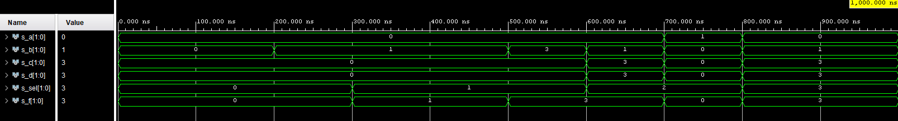

------------------------------------------------------------------------

## 3. A Vivado tutorial
### Your tutorial for Vivado design flow: project creation, adding source file, adding testbench file, running simulation, (adding XDC constraints file)

### 3.1 Creating projekt

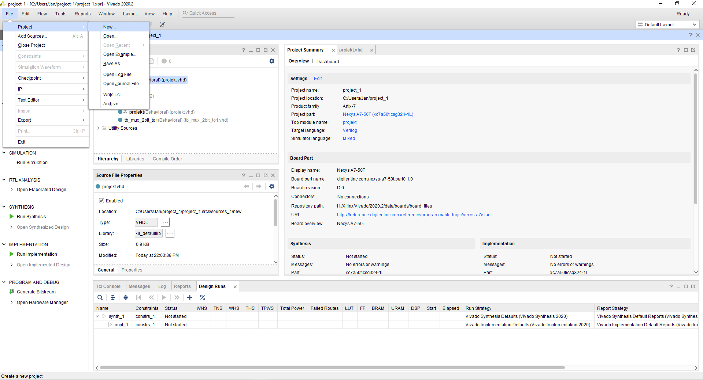
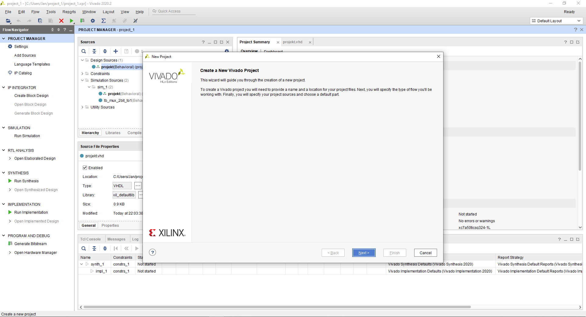
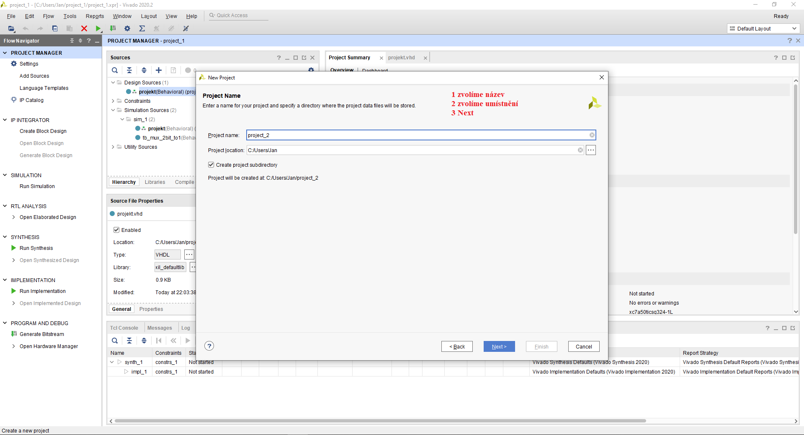
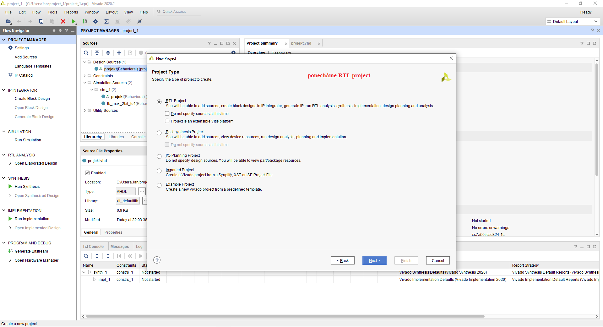
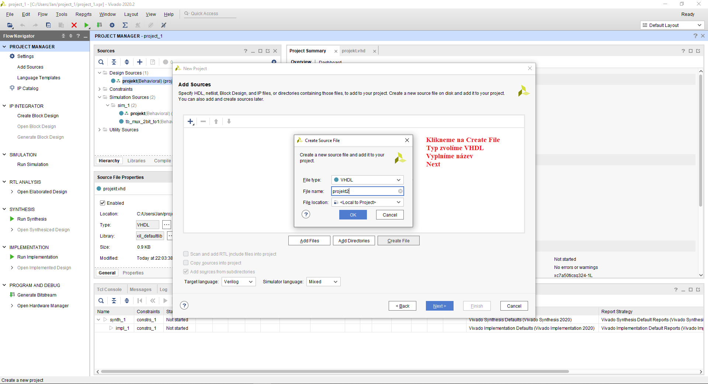
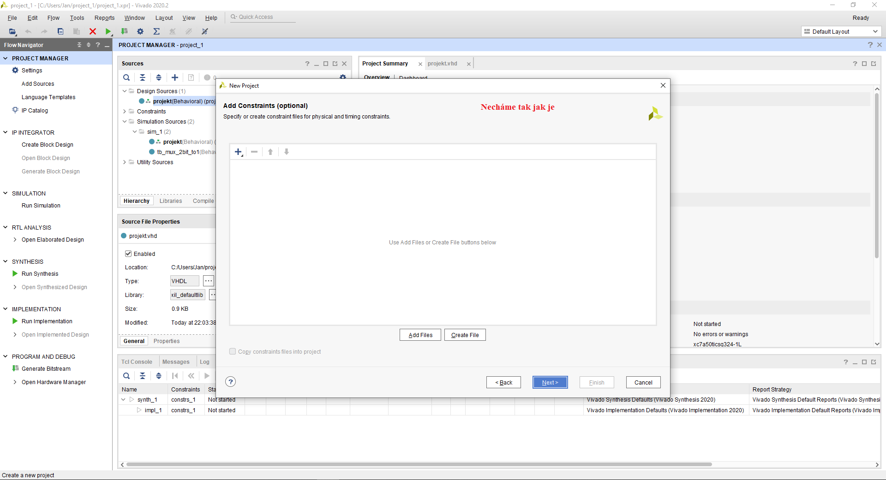
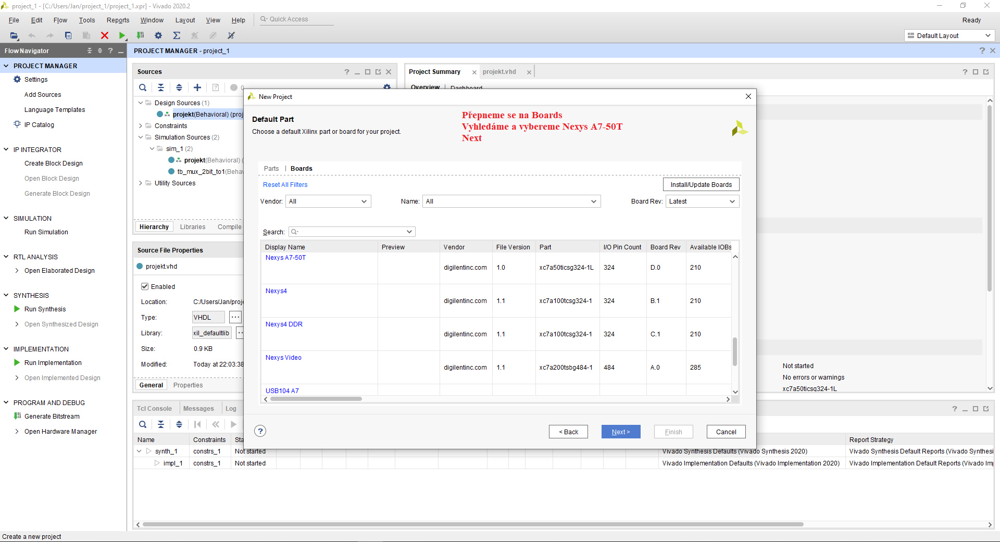
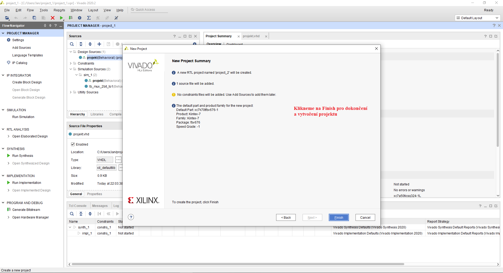
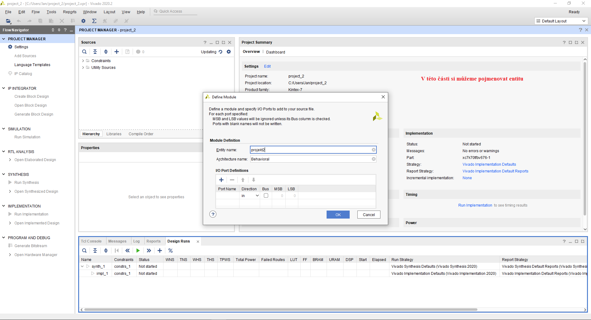
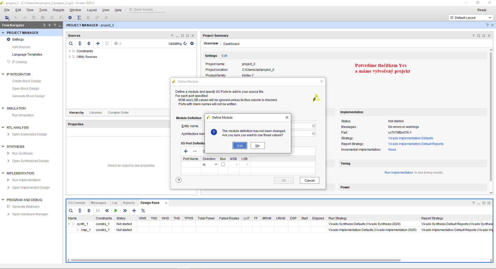

### 3.2 Adding source file

