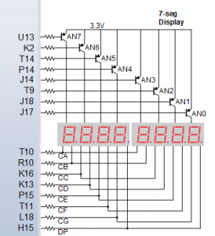

## Lab assignment

1. Preparation tasks (done before the lab at home). Submit:
    * Figure or table with connection of 7-segment displays on Nexys A7 board,
    * Decoder truth table for common anode 7-segment display.

2. Seven-segment display decoder. Submit:
    * Listing of VHDL architecture from source file `hex_7seg.vhd` with syntax highlighting,
    * Listing of VHDL stimulus process from testbench file `tb_hex_7seg.vhd` with syntax highlighting and asserts,
    * Screenshot with simulated time waveforms; always display all inputs and outputs,
    * Listing of VHDL code from source file `top.vhd` with 7-segment module instantiation.

3. LED(7:4) indicators. Submit:
    * Truth table and listing of VHDL code for LEDs(7:4) with syntax highlighting,
    * Screenshot with simulated time waveforms; always display all inputs and outputs.

------------------------------------------------------------------------

## 1. Preparation tasks
### Figure or table with connection of 7-segment displays on Nexys A7 board

<!---

  

--->

| **Segment** | **Connection** | **Anode** | **Connection** | 
| :-: | :-: | :-: | :-: |
| CA  | T10 | AN7 | U13 |
| CB  | R10 | AN6 | K2  |
| CC  | K16 | AN5 | T14 |
| CD  | K13 | AN4 | P14 |
| CE  | P15 | AN3 | J14 |
| CF  | T11 | AN2 | T9  |
| CG  | L18 | AN1 | J18 |
| DP  | H15 | AN0 | J17 |

### Decoder truth table for common anode 7-segment display

| **Hex** | **Inputs** | **A** | **B** | **C** | **D** | **E** | **F** | **G** |
| :-: 	 |    :-:     |  :-:  |  :-:  |  :-:  |  :-:  |  :-:  |  :-:  |  :-:  |
| 0   	 |    0000    |   0   |   0   |   0   |   0   |   0   |   0   |   1   |
| 1  	    |    0001    |   1   |   0   |   0   |   1   |   1   |   1   |   1   |
| 2   	 |    0010    |   0   |   0   |   1   |   0   |   0   |   1   |   0   |
| 3  	    |    0011    |   0   |   0   |   0   |   0   |   1   |   1   |   0   |
| 4       |    0100    |   1   |   0   |   0   |   1   |   1   |   0   |   0   |
| 5       |    0101    |   0   |   1   |   0   |   0   |   1   |   0   |   0   |
| 6       |    0110    |   0   |   1   |   0   |   0   |   0   |   0   |   0   |
| 7       |    0111    |   0   |   0   |   0   |   1   |   1   |   1   |   1   |
| 8       |    1000    |   0   |   0   |   0   |   0   |   0   |   0   |   0   |
| 9       |    1001    |   0   |   0   |   0   |   0   |   1   |   0   |   0   |
| A       |    1010    |   0   |   0   |   0   |   1   |   0   |   0   |   0   |
| B       |    1011    |   1   |   1   |   0   |   0   |   0   |   0   |   0   |
| C       |    1100    |   0   |   1   |   1   |   0   |   0   |   0   |   1   |
| D       |    1101    |   1   |   0   |   0   |   0   |   0   |   1   |   0   |
| E       |    1110    |   0   |   1   |   1   |   0   |   0   |   0   |   0   |
| F       |    1111    |   0   |   1   |   1   |   1   |   0   |   0   |   0   |

------------------------------------------------------------------------

