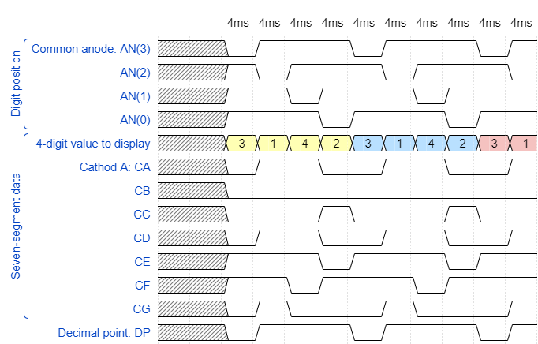

## Lab assignment

1. Preparation tasks (done before the lab at home). Submit:
    * Timing diagram figure for displaying value `3.142`.

2. Display driver. Submit:
    * Listing of VHDL code of the process `p_mux` with syntax highlighting.
    * Listing of VHDL testbench file `tb_driver_7seg_4digits` with syntax highlighting and asserts,
    * Screenshot with simulated time waveforms; always display all inputs and outputs,
    * Listing of VHDL architecture of the top layer.

3. Eight-digit driver. Submit:
    * Image of the driver schematic. The image can be drawn on a computer or by hand.

------------------------------------------------------------------------

## 1. Preparation tasks
### Timing diagram figure for displaying value `3.142`

##  2. Display driver
### 3. Listing of VHDL code of the process `p_mux` with syntax highlighting

