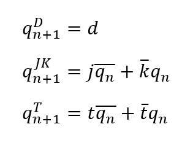
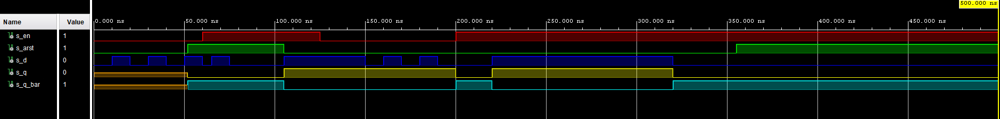
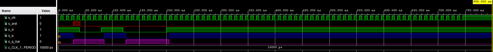
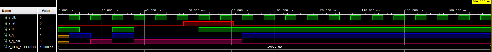
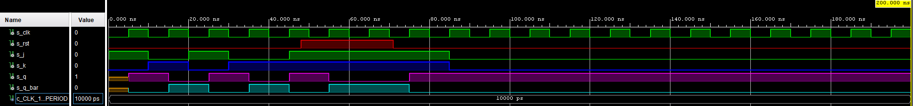
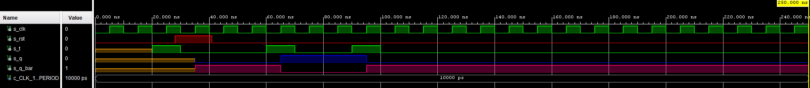

## Lab assignment

1. Preparation tasks (done before the lab at home). Submit:
    * Characteristic equations and completed tables for D, JK, T flip-flops.

2. D latch. Submit:
    * VHDL code listing of the process `p_d_latch` with syntax highlighting,
    * Listing of VHDL reset and stimulus processes from the testbench `tb_d_latch.vhd` file with syntax highlighting and asserts,
    * Screenshot with simulated time waveforms; always display all inputs and outputs. The full functionality of the entity must be verified.

3. Flip-flops. Submit:
    * VHDL code listing of the processes `p_d_ff_arst`, `p_d_ff_rst`, `p_jk_ff_rst`, `p_t_ff_rst` with syntax highlighting,
    * Listing of VHDL clock, reset and stimulus processes from the testbench files with syntax highlighting and asserts,
    * Screenshot with simulated time waveforms; always display all inputs and outputs. The full functionality of the entities must be verified.

4. Shift register. Submit:
    * Image of the shift register schematic. The image can be drawn on a computer or by hand. Name all inputs, outputs, components and internal signals.

------------------------------------------------------------------------

## 1. Preparation tasks
### Characteristic equations and completed tables for D, JK, T flip-flops



### 1.1. D-ff
   | D | Qn | Q(n+1) | Comments |
   | :-: | :-: | :-: | :-- |
   | 0 | 0 | 0 | No change |
   | 0 | 1 | 0 | Reset  |
   | 1 | 0 | 1 | No change |
   | 1 | 1 | 1 | Set |

### 1.2. JK-ff

   | J | K | Qn | Q(n+1) | Comments |
   | :-: | :-: | :-: | :-: | :-- |
   | 0 | 0 | 0 | 0 | No change |
   | 0 | 0 | 1 | 1 | No change |
   | 0 | 1 | 0 | 0 | Reset |
   | 0 | 1 | 1 | 0 | Reset |
   | 1 | 0 | 0 | 1 | Set |
   | 1 | 0 | 1 | 1 | Set |
   | 1 | 1 | 0 | 1 | Invert |
   | 1 | 1 | 1 | 0 | Invert |

### 1.3. T-ff

   | T | Qn | Q(n+1) | Comments |
   | :-: | :-: | :-: | :-- |
   | 0 | 0 | 0 | No change |
   | 0 | 1 | 1 | No change |
   | 1 | 0 | 1 | Invert |
   | 1 | 1 | 0 | Invert |

## D latch
### VHDL code listing of the process `p_d_latch` with syntax highlighting

```vhdl
    p_d_latch : process (d, arst, en)                                                        
    
    begin                                                                                    
        if (arst = '1') then                                                                 
            q     <= '0';                                                                    
            q_bar <= '1';                                                                    
        
        elsif (en = '1') then                                                              
            q     <= d;                                                                          
            q_bar <= not d;                                                                  
        end if;                                                                              
    end process p_d_latch;                                                                   
```

### Listing of VHDL reset and stimulus processes from the testbench `tb_d_latch.vhd` file with syntax highlighting and asserts
```vhdl
p_reset_gen: process
begin
        s_arst <= '0';
        wait for 52 ns;
        -- reset activated
        s_arst <= '1';
        wait for 53ns;
        -- reset deactivated
        s_arst <= '0';
        wait for 250ns;
        s_arst <= '1';
        wait;
end process p_reset_gen;

p_stimulus : process
    begin
        report "Stimulus process started" severity note;
        s_en    <= '0';
        s_d     <= '0';

        wait for 10 ns;
        s_d <= '1';
        wait for 10 ns;
        s_d <= '0';
        wait for 10 ns;
        s_d <= '1';
        wait for 10 ns;
        s_d <= '0';
        wait for 10 ns;
        s_d <= '1';
        wait for 10 ns;
        s_d <= '0';

        s_en <= '1'; wait for 5 ns;
        assert(s_q = '0' and s_q_bar = '1')
        report "Expected: 0, 1" severity error;
        
        s_d <= '1';
        wait for 10 ns;
        s_d <= '0';
        wait for 10 ns;
        s_d <= '0';
        wait for 10 ns;
        s_d <= '0';
        wait for 10 ns;
        s_d <= '1';
        wait for 10 ns;
        s_d <= '1';
        wait for 10 ns;
        s_d <= '1';
        
        s_en <= '0'; wait for 5 ns;
        assert(s_q = '1' and s_q_bar = '0') 
        report "Expected: 1, 0" severity error;
        
        wait for 10 ns;
        s_d <= '1';
        wait for 10 ns;
        s_d <= '0';
        wait for 10 ns;
        s_d <= '1';
        wait for 10 ns;
        s_d <= '0';
        wait for 10 ns;
        s_d <= '1';
        wait for 10 ns;
        s_d <= '0';
        wait for 10 ns;
        s_d <= '0';      
        
        s_en <= '1'; wait for 20 ns;
        assert(s_q = '0' and s_q_bar = '1') 
        report "Expected: 1" severity error;
               
        s_d  <= '1';
        wait for 100ns;
        s_d  <= '0';
        wait for 100ns;
        
        report "Stimulus process finished" severity note;
        
        wait;
        
end process p_stimulus;
```

### Screenshot with simulated time waveforms



## 3. Flip-flops

### VHDL code listing of the processes `p_d_ff_arst`, `p_d_ff_rst`, `p_jk_ff_rst`, `p_t_ff_rst` with syntax highlighting

### 3.1 p_d_ff_arst
```vhdl
p_d_ff_arst : process (clk, arst)
    begin
        if (arst = '1' ) then
            q     <= '0';
            q_bar <= '1';
        elsif rising_edge (clk)then
            q     <= d;
            q_bar <= not d; 
        end if;
    end process p_d_ff_arst;
```

### 3.2 p_d_ff_rst
```vhdl
  p_d_ff_rst : process (clk)
  begin
      if rising_edge(clk) then
          if(rst = '1') then
              q     <= '0';
              q_bar <= '1';
          else
              q     <= d;
              q_bar <= not d;
          end if;    
      end if;
  end process p_d_ff_rst;
```

### 3.3 p_jk_ff_rst
```vhdl
  p_jk_ff_rst : process (clk)
  begin
      if rising_edge(clk) then
          if(rst = '1') then
              s_q     <= '0';
              s_q_bar <= '1';
          else
              if (j = '0' and k = '0') then
                  s_q     <= s_q;
                  s_q_bar <= s_q_bar;
              elsif(j = '0' and k = '1') then
                  s_q     <= '0';
                  s_q_bar <= '1';
              elsif(j = '1' and k = '0') then
                  s_q     <= '1';
                  s_q_bar <= '0';
              else
                  s_q     <= not s_q;
                  s_q_bar <= not s_q_bar;
              end if;
          end if;    
      end if;
  end process p_jk_ff_rst;

  q     <= s_q;
  q_bar <= s_q_bar;
```

### 3.4 p_t_ff_rst
```vhdl
p_t_ff_rst : process (clk)
begin
    if rising_edge(clk) then
        if (rst = '1') then
            s_q     <= '0';
            s_q_bar <= '1';
        elsif (t = '0') then
            s_q     <= s_q;
            s_q_bar <= s_q_bar;
        else
            s_q     <= not s_q;
            s_q_bar <= not s_q_bar;
        end if;
    end if;    
end process p_t_ff_rst;

q     <= s_q;
q_bar <= s_q_bar;
```

### Listing of VHDL reset and stimulus processes from the testbench `tb_d_latch.vhd` file with syntax highlighting and asserts

### 3.1 p_d_ff_arst
```vhdl
     --------------------------------------------------------------------
    -- Clock generation process
    --------------------------------------------------------------------
    p_clk_gen : process
    begin
        while now < 750 ns loop         
            s_clk <= '0';
            wait for c_CLK_100MHZ_PERIOD / 2;
            s_clk <= '1';
            wait for c_CLK_100MHZ_PERIOD / 2;
        end loop;
        wait;                           
    end process p_clk_gen;
     
    --------------------------------------------------------------------
    -- Reset generation process
    --------------------------------------------------------------------
    p_reset_gen : process 
    begin
        s_arst <= '0';
        wait for 28 ns;
        s_arst <= '1';
        wait for 13 ns;
        s_arst <= '0';                
        wait;
    end process p_reset_gen;
    
    --------------------------------------------------------------------
    -- Data generation process
    --------------------------------------------------------------------
       p_stimulus : process
    begin
        report "Stimulus process started" severity note;
        
        s_d <= '1';
        wait for 40ns;
        assert (s_q = '0' and s_q_bar = '1')
        report "Error" severity note;
        
        s_d <= '0';
        wait for 40ns;
        assert (s_q = '0' and s_q_bar = '1')
        report "Error" severity note;
        
        s_d <= '1';
        wait for 40ns;
        assert (s_q = '1' and s_q_bar = '0')
        report "Error" severity note;
       
        s_d <= '0';
        wait for 40ns;
        assert (s_q = '0' and s_q_bar = '1')
        report "Error" severity note;
        
        wait for 40ns;
        s_d <= '1';
        wait for 20ns;
        assert (s_q = '0' and s_q_bar = '1')
        report "Error" severity note;
 
        report "Stimulus process finished" severity note;
                
        wait;
    end process p_stimulus;
```


### 3.2 p_d_ff_rst
```vhdl
    --------------------------------------------------------------------
    -- Clock generation process
    --------------------------------------------------------------------
    p_clk_gen : process
    begin
        while now < 750 ns loop         
            s_clk <= '0';
            wait for c_CLK_100MHZ_PERIOD / 2;
            s_clk <= '1';
            wait for c_CLK_100MHZ_PERIOD / 2;
        end loop;
        wait;                           
    end process p_clk_gen;
    
    --------------------------------------------------------------------
    -- Reset generation process
    --------------------------------------------------------------------
    p_reset_gen : process 
    begin
        s_rst <= '0';
        wait for 58 ns;
        s_rst <= '1';
        wait for 23 ns;
        s_rst <= '0';                
        wait;
    end process p_reset_gen;
    

    --------------------------------------------------------------------
    -- Data generation process
    --------------------------------------------------------------------
    p_stimulus : process
    begin
        report "Stimulus process started" severity note;
        
        s_d <= '1';
        wait for 10ns;
        assert (s_q = '1' and s_q_bar = '0')
        report "Error" severity note;
        
        s_d <= '0';
        wait for 15ns;
        assert (s_q = '0' and s_q_bar = '1')
        report "Error" severity note;
        
        s_d <= '1';
        wait for 10ns;
        assert (s_q = '0' and s_q_bar = '1')
        report "Error" severity note;
       
        s_d <= '0';
        wait for 10ns;
        assert (s_q = '0' and s_q_bar = '1')
        report "Error" severity note;
        
        wait for 30ns;
        s_d <= '1';
        wait for 10ns;
        assert (s_q = '1' and s_q_bar = '0')
        report "Error" severity note;
 
        report "Stimulus process finished" severity note;
        
       
        wait;
    end process p_stimulus;
```


### 3.3 p_jk_ff_rst
```vhdl
--------------------------------------------------------------------
-- Clock generation process
--------------------------------------------------------------------
    p_clk_gen : process
    begin
        while now < 750 ns loop         
            s_clk <= '0';
            wait for c_CLK_100MHZ_PERIOD / 2;
            s_clk <= '1';
            wait for c_CLK_100MHZ_PERIOD / 2;
        end loop;
        wait;                           
    end process p_clk_gen;

--------------------------------------------------------------------
-- Reset generation process
--------------------------------------------------------------------
    p_reset_gen : process 
    begin
        s_rst <= '0';
        wait for 48 ns;
        s_rst <= '1';
        wait for 23 ns;
        s_rst <= '0';                
        wait;
    end process p_reset_gen;

 --------------------------------------------------------------------
 -- Data generation process
 --------------------------------------------------------------------
    p_stimulus : process
    begin
        report "Stimulus process started" severity note;
        
        s_j <= '1';
        s_k <= '0';
        wait for 10ns;
        assert (s_q = '1' and s_q_bar = '0')
        report "Error" severity note;
        
        s_j <= '0';
        s_k <= '1';
        wait for 10ns;
        assert (s_q = '0' and s_q_bar = '1')
        report "Error" severity note;
        
        s_j <= '1';
        s_k <= '0';
        wait for 10ns;
        assert (s_q = '1' and s_q_bar = '0')
        report "Error" severity note;
       
        s_j <= '0';
        s_k <= '1';
        wait for 15ns;
        assert (s_q = '0' and s_q_bar = '1')
        report "Error" severity note;  
        
        s_j <= '1';
        s_k <= '1';
        wait for 10ns;
        assert (s_q = '1' and s_q_bar = '0')
        report "Error" severity note;
        
        s_j <= '1';
        s_k <= '1';
        wait for 15ns;
        assert (s_q = '0' and s_q_bar = '1')
        report "Error" severity note;
        
        s_j <= '1';
        s_k <= '1';
        wait for 15ns;
        assert (s_q = '1' and s_q_bar = '0')
        report "Error" severity note;
        
        s_j <= '0';
        s_k <= '0';
        wait for 10ns;
        assert (s_q = '1' and s_q_bar = '0')
        report "Error" severity note;
 
        report "Stimulus process finished" severity note;
                
        wait;
    end process p_stimulus;
```



### 3.4 p_t_ff_rst

```vhdl
--------------------------------------------------------------------
    -- Clock generation process
    --------------------------------------------------------------------
    p_clk_gen : process
    begin
        while now < 750 ns loop         
            s_clk <= '0';
            wait for c_CLK_100MHZ_PERIOD / 2;
            s_clk <= '1';
            wait for c_CLK_100MHZ_PERIOD / 2;
        end loop;
        wait;                           
    end process p_clk_gen;
    
    --------------------------------------------------------------------
    -- Reset generation process
    --------------------------------------------------------------------
    p_reset_gen : process 
    begin
        s_rst <= '0';
        wait for 38 ns;
        s_rst <= '1';
        wait for 20 ns;
        s_rst <= '0';                
        wait;
    end process p_reset_gen;
    
    --------------------------------------------------------------------
    -- Data generation process
    --------------------------------------------------------------------
    p_stimulus : process
    begin
        report "Stimulus process started" severity note;
        
        wait for 20ns;
        s_t <= '1';
        wait for 10ns;
        assert (s_q = '1' and s_q_bar = '0')
        report "Error" severity note;
        
        s_t <= '0';
        wait for 30ns;
        assert (s_q = '1' and s_q_bar = '0')
        report "Error" severity note;
        
        s_t <= '1';
        wait for 10ns;
        assert (s_q = '0' and s_q_bar = '1')
        report "Error" severity note;
        
        s_t <= '0';
        wait for 20ns;
        assert (s_q = '0' and s_q_bar = '1')
        report "Error" severity note;
        
        s_t <= '1';
        wait for 10ns;
        assert (s_q = '1' and s_q_bar = '0')
        report "Error" severity note;
        
        s_t <= '0';
        wait for 20ns;
        assert (s_q = '1' and s_q_bar = '0')
        report "Error" severity note;
 
        report "Stimulus process finished" severity note;
                
        wait;
    end process p_stimulus;
```



## 4. Shift register
### Image of the shift register schematic

