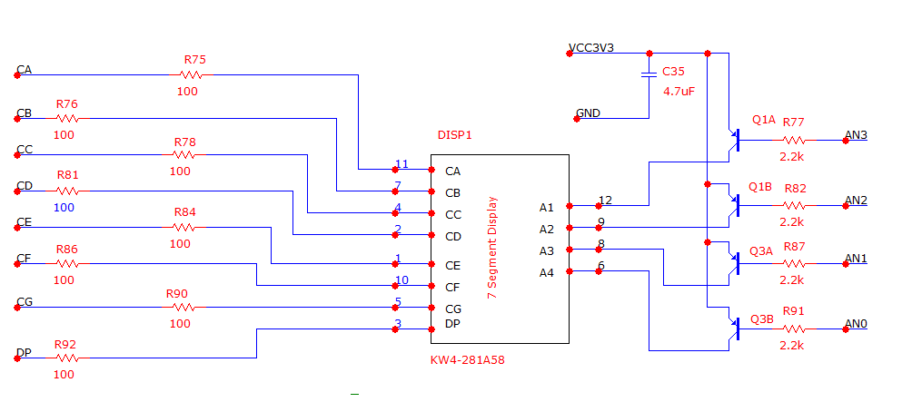
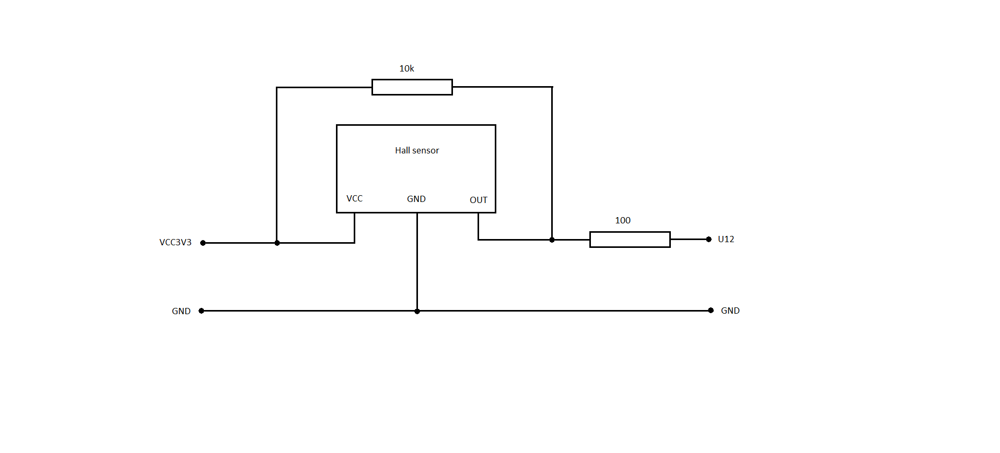
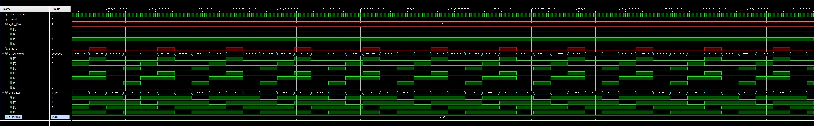
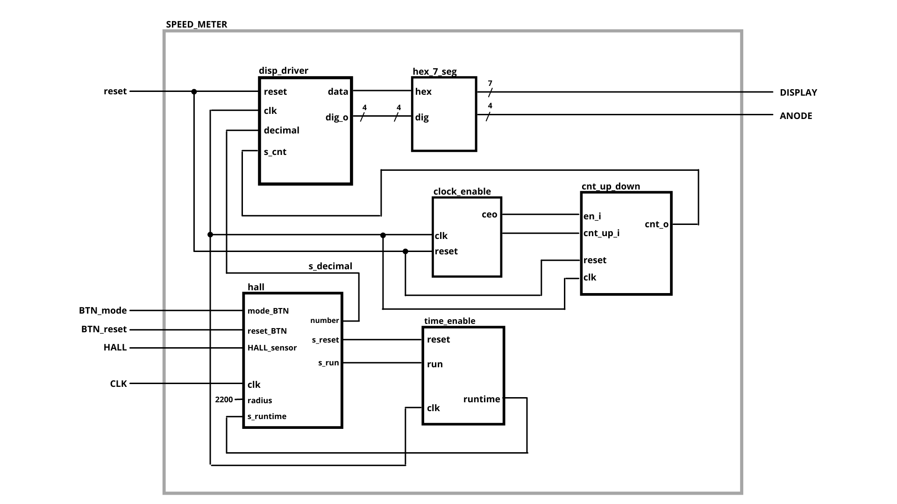
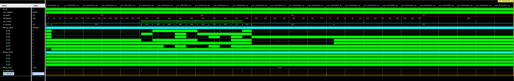

# CONSOLE FOR EXERCISE BIKE - PROJECT

## Team members

Dziuina Valeriia - https://github.com/valdzyu/Digital-electronics-1

Fabulec Martin - https://github.com/Fabulec/Digital-electronics-2

Fašanga Jozef - https://github.com/Jofadodo/Digital-electronics-3

Frolka Jan - https://github.com/xfrolk03/Digital-electronics-1-2021

Galovič Dominik - https://github.com/Dominik220888/Digital-electronics-1

## Project objectives

Objective of this project is to use previous experience to implement the hall sensor to measure the speed and distance on the exercise bike
and to use this implementation, so the simulation will show us the results, f.e. the distance traveled, or used speed.
We want to make a switch, so when you you use it, it will show distance or speed. We also want to divide value of distance/speed into four seven segment displays and use button for setting a wheel circuit.

## Hardware description

The project is implementable on Arty A7-35T board, we are using hall sensor and modules from previous tutorials - clock enable, hex_7seg, cnt_up_down, driver_7segment_4digits

**Connections of 7 Segment Display**



**Connections of Hall sensor**


**Tables with connections on board**

| **Connector** | **Pin on board** |
| :-: | :-: |
| CA | G13 |
| CB | B11 |
| CC | A11 |
| CD | D12 |
| CE | D13 |
| CF | B18 |
| CG | A18 |
| DP | K16 |
| -- | -- |
| VCC3V3 | 3V3 |
| GND | GND |


| **Anode** | **Pin on board** |
| :-: | :-: |
| AN[0] | E15 |
| AN[1] | E16 |
| AN[2] | D15 |
| AN[3] | C15 |


| **Hall sensor connector** | **Pin on board** |
| :-: | :-: |
| Hall_sensor | U12 |
| Hall_VCC | 3V3 |
| Hall_GND | GND |


## VHDL modules description

### driver_7seg_4digits.vhd module code
 
```vhdl
------------------------------------------------------------------------
-- Entity declaration for display driver
------------------------------------------------------------------------
entity driver_7seg_4digits is
    port(
        clk     : in  std_logic;                        -- main clock
        reset   : in  std_logic;                        -- synchronous reset
        dp_i    : in  std_logic_vector(4 - 1 downto 0); -- 4 bit value input for decimal point

        decimal : in integer range 0 to 9999;           -- number to display

        dp_o    : out std_logic;                        -- decimal point for specific digit
        seg_o   : out std_logic_vector(7 - 1 downto 0); -- cathode output for individual segments
        dig_o   : out std_logic_vector(4 - 1 downto 0)  -- common anode signals output to individual displays
    );
end entity driver_7seg_4digits;

------------------------------------------------------------------------
-- Architecture with signals declaration
------------------------------------------------------------------------
architecture Behavioral of driver_7seg_4digits is

    signal s_en  : std_logic; -- internal clock enable
    signal s_cnt : std_logic_vector(2 - 1 downto 0); -- internal 2-bit counter for multiplexing 4 digits

    signal s_hex : integer range 0 to 9999; -- internal integer value for 7 segment decoder
    signal s_decimal : integer range 0 to 9999; -- internal integer value for displaying digits
    
    signal buff     : integer:=0;
    signal buff2    : integer:=0;
    signal thousands : integer:=0; -- 
    signal hundreds : integer:=0;
    signal decimals : integer:=0;
    signal ones     : integer:=0;
    
    signal s_data0_i : integer range 0 to 9999;
    signal s_data1_i : integer range 0 to 9999;
    signal s_data2_i : integer range 0 to 9999;
    signal s_data3_i : integer range 0 to 9999;

begin

    s_decimal <= decimal;
    
    -- instance copy of clock_enable entity
    clk_en0 : entity work.clock_enable
        generic map(
            g_MAX => 4
        )
        port map(
            clk   => clk,
            reset => reset,
            ce_o  => s_en
        );

    -- instance copy of hex_7seg entity
    hex2seg : entity work.hex_7seg
        port map(
            hex_i => s_hex,
            seg_o => seg_o
        );
        
    -- instance copy of cnt_up_down entity
    bin_cnt0 : entity work.cnt_up_down
        generic map(
            g_CNT_WIDTH => 2
       )
        port map(
            clk  => clk,
            reset  => reset,
            en_i  => s_en,
            cnt_up_i  => '0',
            cnt_o  => s_cnt
        );

------------------------------------------------------------------------
-- Process p_mux_dec:
-- s_decimal integer number split to digits
-- writing digits to s_data and display them on 7 segment display using hex_7seg
------------------------------------------------------------------------
    p_mux_dec : process(clk, s_decimal)    
    begin
        if(buff2 /= s_decimal) then
            buff2 <= s_decimal;
            buff <= 0;
        end if;

        if(s_decimal >= (buff + 1000)) then
            buff <= buff + 1000;
            thousands <= thousands + 1;
        elsif(s_decimal >= (buff + 100)) then 
            buff <= buff + 100;
            hundreds <= hundreds + 1;
        elsif(s_decimal >= (buff + 10)) then 
            buff <= buff + 10;
            decimals <= decimals + 1;
        elsif(s_decimal >= (buff + 1)) then 
            buff <= buff + 1;
            ones <= ones + 1;
        end if;


        
        if(s_decimal = buff) then
            -- write numbers to s_data
            s_data3_i <= thousands;
            s_data2_i <= hundreds;
            s_data1_i <= decimals;
            s_data0_i <= ones;
            
            -- clear buffer and digits
            buff <= 0;
            
            thousands <= 0;
            hundreds <= 0;
            decimals <= 0;
            ones <= 0;
        end if;
        
    end process p_mux_dec;
    
--------------------------------------------------------------------
-- Process p_mux:
-- A combinational process that implements a multiplexer for
-- selecting data for a single digit, a decimal point signal, and 
-- switches the common anodes of each display.
--------------------------------------------------------------------
    p_mux : process(s_cnt, dp_i)
    begin
        case s_cnt is
            when "11" =>
                s_hex <= s_data3_i;
                dp_o  <= dp_i(3);
                dig_o <= "0111";

            when "10" =>
                s_hex <= s_data2_i;
                dp_o  <= dp_i(2);
                dig_o <= "1011";

            when "01" =>
                s_hex <= s_data1_i;
                dp_o  <= dp_i(1);
                dig_o <= "1101";

            when others =>
                s_hex <= s_data0_i;
                dp_o  <= dp_i(0);
                dig_o <= "1110";
        end case;
    end process p_mux;

end architecture Behavioral;
```


## tb_driver_7seg_4digits code

```vhdl
library ieee;
use ieee.std_logic_1164.all;

------------------------------------------------------------------------
-- Entity declaration for testbench
------------------------------------------------------------------------
entity tb_driver_7seg_4digits is
    -- Entity of testbench is always empty
end entity tb_driver_7seg_4digits;

------------------------------------------------------------------------
-- Architecture body for testbench
------------------------------------------------------------------------
architecture testbench of tb_driver_7seg_4digits is

    -- Local constants
    constant c_CLK_100MHZ_PERIOD : time    := 10 ns;

    --Local signals
    signal s_clk_100MHz : std_logic;
    --- WRITE YOUR CODE HERE
            
    signal s_reset      : std_logic;
    
    signal s_dp_i       : std_logic_vector(4 - 1 downto 0);
    signal s_dp_o       : std_logic;
    signal s_seg_o      : std_logic_vector(7 - 1 downto 0);
    
    signal s_dig        : std_logic_vector(4 - 1 downto 0);
    
    signal s_decimal    : integer range 0 to 9999;
    
    

begin
    -- Connecting testbench signals with driver_7seg_4digits entity
    -- (Unit Under Test)
    --- WRITE YOUR CODE HERE
        
    uut_driver_7seg_4digits : entity work.driver_7seg_4digits
        port map(
            clk => s_clk_100MHz,
            reset => s_reset,

            dp_i => s_dp_i,

            dp_o  => s_dp_o,
            seg_o => s_seg_o,
            dig_o => s_dig,
            
            decimal => s_decimal
        );

    --------------------------------------------------------------------
    -- Clock generation process
    --------------------------------------------------------------------
    p_clk_gen : process
    begin
        while now < 5 ms loop         -- 75 periods of 100MHz clock
            s_clk_100MHz <= '0';
            wait for c_CLK_100MHZ_PERIOD / 2;
            s_clk_100MHz <= '1';
            wait for c_CLK_100MHZ_PERIOD / 2;
        end loop;
        wait;
    end process p_clk_gen;

    --------------------------------------------------------------------
    -- Reset generation process
    --------------------------------------------------------------------
    p_reset_gen : process
    begin
        s_reset <= '0';
        wait for 28 ns;
        
        -- Reset activated
        s_reset <= '1';
        wait for 53 ns;

        s_reset <= '0';
        wait;
        
    end process p_reset_gen;

    --------------------------------------------------------------------
    -- Data generation process
    --------------------------------------------------------------------
    p_stimulus : process
    begin
        report "Stimulus process started" severity note;

        
        s_decimal <= 2548;
        s_dp_i <= "0010";
        

        report "Stimulus process finished" severity note;
        wait;
    end process p_stimulus;
end architecture testbench;
```

## Simulation of driver


### hall.vhd module code
 
```vhdl
library IEEE;
use IEEE.STD_LOGIC_1164.ALL;

-- Uncomment the following library declaration if using
-- arithmetic functions with Signed or Unsigned values
use IEEE.NUMERIC_STD.ALL;

-- Uncomment the following library declaration if instantiating
-- any Xilinx leaf cells in this code.
--library UNISIM;
--use UNISIM.VComponents.all;

entity hall is
    port(
            clk            : in std_logic;
            hall_sensor    : in std_logic;
            wheel_circuit  : in integer;
            
            mode_BTN       : in std_logic;
            reset_BTN      : in std_logic;
            
            number  : out integer
        );
end hall;

architecture Behavioral of hall is

    signal s_reset  : std_logic;
    signal s_run    : std_logic;
    signal s_mode   : std_logic:='0';
    
    signal s_runtime  : integer;
    signal speed      : integer:=0;
    signal distance   : integer:=0;

begin

    time_stop : entity work.time_enable
        port map(
            runtime => s_runtime,
            clk     => clk,
            reset   => s_reset,
            run     => s_run
        );
        
    speed_calc : process(clk)
    begin
    
        if (s_reset = '1') then 
            s_reset <= '0';
        end if;
    
        if (rising_edge(hall_sensor)) then
            speed <= (wheel_circuit*1000) / (s_runtime + 1); 
                 
            s_reset <= '1';
        end if;
        
    end process;
    
    dist_calc : process(clk, hall_sensor)
    begin
    
        if (rising_edge(hall_sensor)) then
        
            distance <= distance + (wheel_circuit / 100);
            
        end if;
        
        if (rising_edge(reset_BTN)) then
            distance <= 0;
        end if;
        
    end process;
    
    view : process(clk)
    begin
    
        if (rising_edge(mode_BTN)) then
            s_mode <= not(s_mode);
        end if;
        
        case s_mode is
            when '0' =>
                number <= speed;
            when '1' =>
                number <= distance;
            when others =>
                number <= speed;
        end case;
        
    end process;

end Behavioral;
```

## TOP module description

**Block diagram of top module**



### top.vhd module code
```vhdl 
library IEEE;
use IEEE.STD_LOGIC_1164.ALL;

-- Uncomment the following library declaration if using
-- arithmetic functions with Signed or Unsigned values
--use IEEE.NUMERIC_STD.ALL;

-- Uncomment the following library declaration if instantiating
-- any Xilinx leaf cells in this code.
--library UNISIM;
--use UNISIM.VComponents.all;

entity top is
Port ( 
    
           CLK100MHZ   : in STD_LOGIC;
           BTN0        : in STD_LOGIC;
           BTN1        : in STD_LOGIC;
           BTN2        : in STD_LOGIC;
           hall        : in STD_LOGIC;
           
           CA          : out STD_LOGIC;
           CB          : out STD_LOGIC;
           CC          : out STD_LOGIC;
           CD          : out STD_LOGIC;
           CE          : out STD_LOGIC;
           CF          : out STD_LOGIC;
           CG          : out STD_LOGIC;
           
           DP          : out STD_LOGIC;
           
           AN          : out STD_LOGIC_VECTOR (4 - 1 downto 0)
           
    );
end top;

architecture Behavioral of top is

    signal s_decimal : integer;

begin        
    driver_seg_4 : entity work.driver_7seg_4digits
        port map(
            clk        => CLK100MHZ,
            reset      => BTN2,

            decimal => s_decimal,

            dp_i => "1110",
            dp_o => DP,
            
            seg_o(6) => CA,
            seg_o(5) => CB,
            seg_o(4) => CC,
            seg_o(3) => CD,
            seg_o(2) => CE,
            seg_o(1) => CF,
            seg_o(0) => CG,
            
            dig_o => AN(4 - 1 downto 0)
        );
        
    hall_sensor : entity work.hall
        port map(
            clk            => CLK100MHZ,
            hall_sensor    => hall,
            wheel_circuit  => 2200,
            mode_BTN       => BTN0,
            reset_BTN      => BTN1,
            

            number         => s_decimal
        );

end architecture Behavioral;
```

### tb_top vhdl code

```vhdl
library IEEE;
use IEEE.STD_LOGIC_1164.ALL;

-- Uncomment the following library declaration if using
-- arithmetic functions with Signed or Unsigned values
--use IEEE.NUMERIC_STD.ALL;

-- Uncomment the following library declaration if instantiating
-- any Xilinx leaf cells in this code.
--library UNISIM;
--use UNISIM.VComponents.all;

entity tb_top is
--  Port ( );
end tb_top;

architecture Behavioral of tb_top is

    -- Local constants
    constant c_CLK_100MHZ_PERIOD : time    := 10 ns;

    --Local signals
    signal s_clk_100MHz : std_logic;
    --- WRITE YOUR CODE HERE
            
    signal s_reset      : std_logic;
    signal s_mode       : std_logic;
    signal s_reset_dist : std_logic;
    
    signal s_dp_i       : std_logic_vector(4 - 1 downto 0);
    signal s_dp_o       : std_logic;
    signal s_seg_o      : std_logic_vector(7 - 1 downto 0);
    
    signal s_dig        : std_logic_vector(4 - 1 downto 0);
    
    signal s_decimal    : integer range 0 to 9999;
    
    signal s_hall      : std_logic;

begin

    uut_driver_7seg_4digits : entity work.driver_7seg_4digits
        port map(
            clk => s_clk_100MHz,
            reset => s_reset,

            dp_i => "1110",

            dp_o  => s_dp_o,
            seg_o => s_seg_o,
            dig_o => s_dig,
            
            decimal => s_decimal
        );
        
    uut_hall : entity work.hall
        port map(
            clk => s_clk_100MHz,
            
            hall_sensor   => s_hall,
            wheel_circuit => 2200,
            mode_BTN      => s_mode,
            reset_BTN     => s_reset_dist,
            
            number => s_decimal
        );

    --------------------------------------------------------------------
    -- Clock generation process
    --------------------------------------------------------------------
    p_clk_gen : process
    begin
        while now < 2000 ms loop         -- 75 periods of 100MHz clock
            s_clk_100MHz <= '0';
            wait for c_CLK_100MHZ_PERIOD / 2;
            s_clk_100MHz <= '1';
            wait for c_CLK_100MHZ_PERIOD / 2;
        end loop;
        wait;
    end process p_clk_gen;

    --------------------------------------------------------------------
    -- Reset generation process
    --------------------------------------------------------------------
    p_reset_gen : process
    begin
        s_reset <= '0';
        wait for 28 ns;
        
        -- Reset activated
        s_reset <= '1';
        wait for 53 ns;

        s_reset <= '0';
        wait;
        
    end process p_reset_gen;
    
    --------------------------------------------------------------------
    -- Data generation process
    --------------------------------------------------------------------
    p_stimulus : process
    begin
        report "Stimulus process started" severity note;

        
        s_hall <= '0';
        s_mode <= '0';
        s_reset_dist <= '0';
        wait for 10 ns;

        while(now < 50 ms) loop
            
            s_hall <= '1';
            wait for 30 ns;
            s_hall <= '0';
            wait for 3 ms;
            
        end loop; 
        
        s_mode <= '1';
        wait for 10 ns;
        s_mode <= '0';
        
        while(now < 100 ms) loop
            
            s_hall <= '1';
            wait for 30 ns;
            s_hall <= '0';
            wait for 6 ms;
            
        end loop; 
        
        s_mode <= '1';
        wait for 10 ns;
        s_mode <= '0';
        
        while(now < 150 ms) loop
            
            s_hall <= '1';
            wait for 30 ns;
            s_hall <= '0';
            wait for 5 ms;
            
        end loop;
        
        s_reset_dist <= '1';
        wait for 10 ns;
        s_reset_dist <= '0';
        
        while(now < 200 ms) loop
            
            s_hall <= '1';
            wait for 30 ns;
            s_hall <= '0';
            wait for 4 ms;
            
        end loop;
        
        s_hall <= '1';
        wait for 30 ns;
        s_hall <= '0';
        wait for 10 ms;
        

        report "Stimulus process finished" severity note;
        wait;
    end process p_stimulus;

end Behavioral;
```

### Simulation


## Video

[VIDEO PRESENTATION](https://www.youtube.com/watch?v=bGpUqRCeRC4)

## References
1. https://www.instructables.com/Basys3-Bicycle-Odometer/
2. https://forum.digikey.com/t/7-segment-display-driver-for-multiple-digits-vhdl/12526
